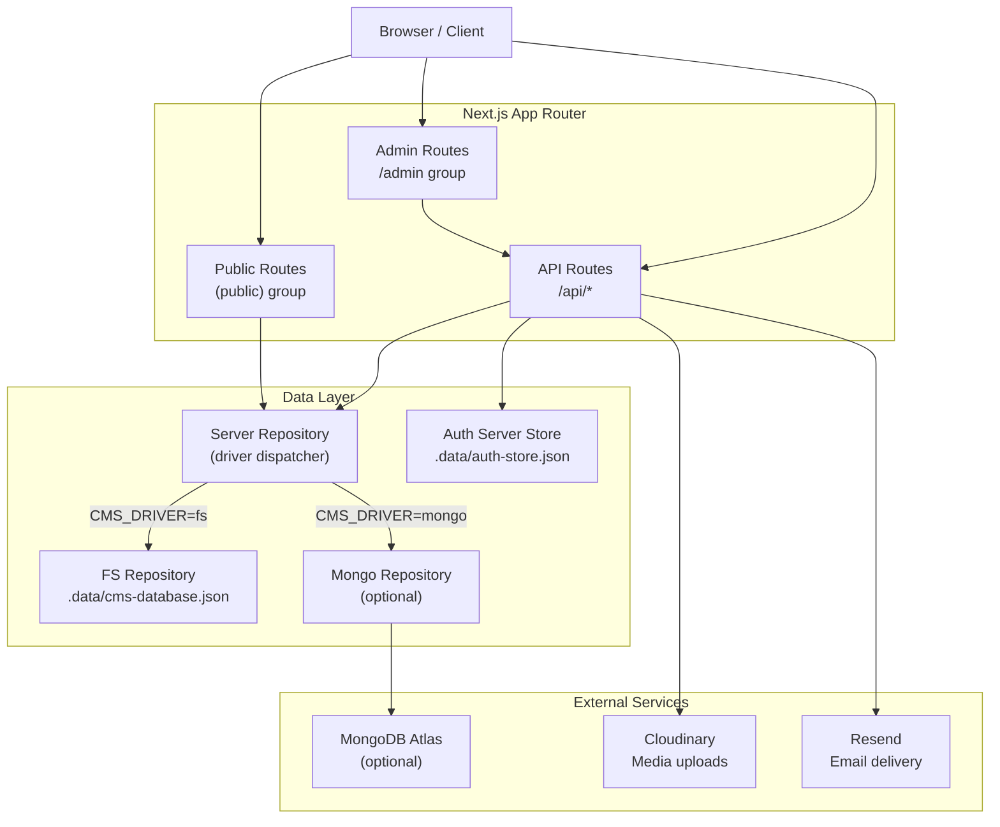
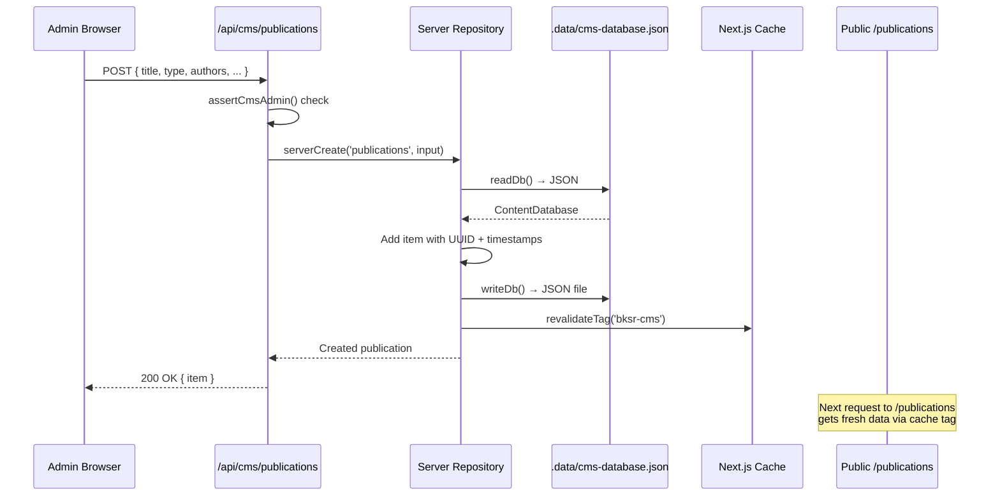
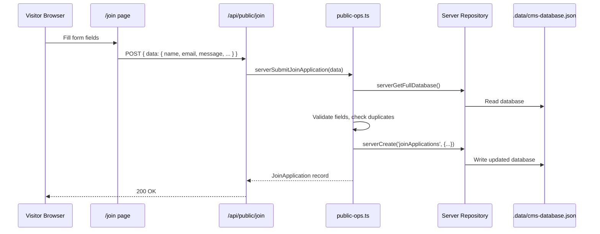
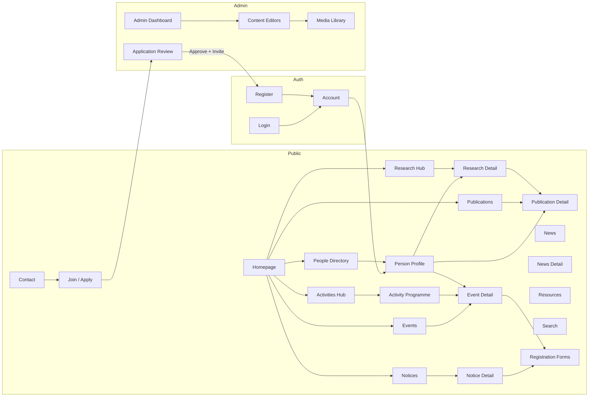

# BK School of Research — Current System Audit & Technical Handover

| Field | Value |
|---|---|
| **Last audited** | Saturday 19 September 2026, 15:30 UTC+6 |
| **Repository state** | Local working tree with uncommitted changes; `main` branch |
| **Application URL** | `http://localhost:3000` (dev), production target `https://bksr.vercel.app` |
| **Admin URL** | `http://localhost:3000/admin` |
| **Audit scope** | Full codebase, running application, seed data, auth system, CMS, all routes |
| **Verification status** | Verified against code + local dev server; production deploy not live-tested |

---

## Table of Contents

1. [Executive Summary](#1-executive-summary)
2. [Project Purpose & Product Model](#2-project-purpose--product-model)
3. [Current Tech Stack](#3-current-tech-stack)
4. [Repository Architecture](#4-repository-architecture)
5. [Application Architecture](#5-application-architecture)
6. [Complete Route Inventory](#6-complete-route-inventory)
7. [Page-by-Page UI/UX Inventory](#7-page-by-page-uiux-inventory)
8. [Homepage — Deep Documentation](#8-homepage--deep-documentation)
9. [Design System / Brand System](#9-design-system--brand-system)
10. [Responsive System](#10-responsive-system)
11. [Animation & Interaction System](#11-animation--interaction-system)
12. [Navigation System](#12-navigation-system)
13. [Content Model](#13-content-model)
14. [Content Source & Legacy Migration](#14-content-source--legacy-migration)
15. [Publications System](#15-publications-system)
16. [Research System](#16-research-system)
17. [People / Team System](#17-people--team-system)
18. [Activities System](#18-activities-system)
19. [News / Events / Notices](#19-news--events--notices)
20. [Resources / Knowledge Hub](#20-resources--knowledge-hub)
21. [Search System](#21-search-system)
22. [Gallery & Media System](#22-gallery--media-system)
23. [Contact System](#23-contact-system)
24. [Authentication System](#24-authentication-system)
25. [Roles & Permissions](#25-roles--permissions)
26. [Join / Apply System](#26-join--apply-system)
27. [Admin / Content Studio — Complete Audit](#27-admin--content-studio--complete-audit)
28. [Homepage CMS](#28-homepage-cms)
29. [CMS Data Flow](#29-cms-data-flow)
30. [Current Storage / Database](#30-current-storage--database)
31. [API / Server Action Inventory](#31-api--server-action-inventory)
32. [Form Inventory](#32-form-inventory)
33. [External Services](#33-external-services)
34. [Environment Variables](#34-environment-variables)
35. [SEO System](#35-seo-system)
36. [Accessibility](#36-accessibility)
37. [Performance](#37-performance)
38. [Security](#38-security)
39. [Generated / Placeholder Content](#39-generated--placeholder-content)
40. [Verified Organizational Content](#40-verified-organizational-content)
41. [Connectivity Map](#41-connectivity-map)
42. [Major User Journeys](#42-major-user-journeys)
43. [Dependency Map](#43-dependency-map)
44. [Testing & Quality State](#44-testing--quality-state)
45. [Deployment / Hosting](#45-deployment--hosting)
46. [Existing Documentation](#46-existing-documentation)
47. [Known Limitations / Technical Debt](#47-known-limitations--technical-debt)
48. [TODO / Not Yet Connected](#48-todo--not-yet-connected)
49. [What Must Not Be Broken](#49-what-must-not-be-broken)
50. [Recommended Next Development Phase](#50-recommended-next-development-phase)
51. [Key File Index](#51-key-file-index)

---

## 1. Executive Summary

### What BKSR Is

BK School of Research (BKSR) is an interdisciplinary research and publication organisation founded in 2015 in Shahjadpur, Sirajganj, Bangladesh. Led by Executive Director Bezon Kumar (Lecturer in Economics at Rabindra University), BKSR generates evidence-based knowledge, mentors young researchers, and works to shape policy across education, public policy, social development, economics, and public health.

### What This Website Currently Provides

A Next.js 16 App Router website serving as the organisation's public presence and content management system. It includes:

- A polished, multi-section homepage with premium editorial design
- Full public pages for research, publications, people, activities, news, events, notices, resources, contact, about, and search
- A built-in CMS (`/admin`) for managing all content types
- A custom authentication system (invite-only member registration with OTP email verification)
- A join/application system for prospective researchers and team members
- Dynamic registration forms for events, vacancies, and sitewide applications

### Current Development Stage

**Late-stage development / pre-production staging.** The frontend is substantially complete with premium editorial UI. The CMS is functional. Authentication works end-to-end. However, the project currently runs on local file-based storage (`.data/cms-database.json`) with MongoDB as an available but currently inactive driver. Content is primarily seed data migrated from the legacy Blogger site, with prototype/generated imagery.

### Overall Status Table

| Area | Status | Notes |
|------|--------|-------|
| Public Frontend | ✅ IMPLEMENTED | 30+ public routes, polished editorial design |
| Responsive UI | ✅ IMPLEMENTED | Mobile-first, tailored breakpoints throughout |
| Admin/CMS | ✅ IMPLEMENTED | Full CRUD for all content types, dashboard, media library |
| Authentication | ✅ IMPLEMENTED | Custom JWT-like session cookies, OTP email, invite flow |
| Database (FS) | ✅ IMPLEMENTED | Local JSON file persistence, works offline |
| Database (Mongo) | 🟡 PARTIAL | Driver exists, schema ready, not currently active (`CMS_DRIVER=fs`) |
| Publications | ✅ IMPLEMENTED | 46 seed publications, filters, detail pages, type sub-routes |
| Research | ✅ IMPLEMENTED | 24 projects, areas, filters, status views |
| People | ✅ IMPLEMENTED | Directory with flip cards, profiles, category hubs |
| Join/Apply | ✅ IMPLEMENTED | CMS-configurable form, server-side submission + admin review |
| Search | 🧪 PROTOTYPE | Client-side seed-data search, functional but not production-grade |
| Media Upload | ✅ IMPLEMENTED | Cloudinary integration for admin uploads |
| Email (Resend) | ✅ IMPLEMENTED | Invite, OTP, contact form delivery via Resend API |
| SEO | 🟡 PARTIAL | Metadata, OG tags, canonical paths; no sitemap/structured data |
| Testing | ⚪ PLACEHOLDER | No test files exist; lint/typecheck scripts present |
| Deployment | 🟡 PARTIAL | Vercel target configured in docs, no vercel.json |

---

## 2. Project Purpose & Product Model

### Organisation Positioning

BKSR positions itself as a **premium editorial academic research/publication institute** — not a lab, university, SaaS platform, or news magazine. The website is designed to reflect this identity through a refined, image-forward editorial aesthetic.

### Intended Audience

- **Academic community**: researchers, scholars, students interested in BKSR's work
- **Policy makers**: government and institutional actors seeking evidence-based research
- **Prospective members**: individuals wanting to join as researchers or administrative staff
- **General public**: anyone seeking information about BKSR's activities, events, or publications

### Major Content Types

1. **Publications** — journal articles, book chapters, opinions, policy briefs, working papers, annual reports, newsletters
2. **Research Projects** — ongoing and completed studies with area classifications
3. **People** — team directory with executive, fellows, research and administrative categories
4. **Activities** — capacity building, awareness campaigns, research talks, innovation showcasing
5. **News** — migrated and new articles
6. **Events** — past and upcoming academic events with registration
7. **Notices** — vacancy, announcement, deadline, general notices
8. **Resources** — knowledge hub with Stata, SPSS, Excel, EViews tutorials and guides

### How Systems Fit Together

```
Public Website ← reads → CMS Content Database (FS or Mongo)
       ↑                         ↑
       |                         |
  Visitor browses           Admin manages
  publications,             content via
  research, people,         /admin dashboard
  events, etc.              
       |                         |
       ↓                         ↓
  Join/Apply form           Review applications,
  → stored in DB            invite → account creation
```

---

## 3. Current Tech Stack

| Layer | Technology | Version | Purpose |
|-------|-----------|---------|---------|
| Framework | Next.js (App Router) | 16.3.3 | Full-stack React framework |
| React | React | 19.2.8 | UI library |
| Language | TypeScript | ^5 | Type safety |
| Styling | Tailwind CSS | ^4 | Utility-first CSS with design tokens |
| Animation | GSAP | ^3.15.0 | Scroll-driven animations, pinning |
| Animation | Motion (Framer Motion) | ^13.1.1 | Component transitions, reveals |
| Animation | Lenis | ^1.3.26 | Smooth scrolling |
| Physics | Matter.js | ^0.20.0 | Pre-footer ball-pit CTA badges |
| Animation | Lottie React | ^3.1.2 | Lottie animations on form panels |
| Icons | Lucide React | ^1.37.0 | Icon library |
| Forms/Validation | Zod | ^4.5.4 | Schema validation |
| Date handling | date-fns | ^4.4.0 | Date formatting |
| Database | MongoDB driver | ^7.6.0 | MongoDB client (optional driver) |
| Auth hashing | bcryptjs | ^3.0.3 | Password hashing (imported but crypto SHA256 used in practice) |
| Media storage | Cloudinary SDK | ^2.11.0 | Image/file uploads |
| Media storage | AWS S3 SDK | ^3.1131.0 | R2 storage (code exists, currently unused) |
| Email | Resend (HTTP API) | — | Invite, OTP, contact form emails |
| Utilities | clsx, tailwind-merge | various | Class merging |
| IDs | uuid | ^14.0.2 | UUID generation for content items |
| CSS processing | @tailwindcss/postcss | ^4 | PostCSS plugin |
| Linting | ESLint + eslint-config-next | ^9 / 16.3.3 | Code quality |

### Not Used (despite being in dependencies)
- `bcryptjs` — imported but the actual auth system uses `crypto.createHash('sha256')` with salt
- `@aws-sdk/client-s3` / `@aws-sdk/s3-request-presigner` — R2 storage module exists at `src/lib/storage/r2.ts` but is not actively used; Cloudinary is the media provider

---

## 4. Repository Architecture

```
bksr-website/
├── .data/                          # Local CMS persistence (gitignored)
│   ├── cms-database.json           # Full content database (FS driver)
│   └── auth-store.json             # Accounts, sessions, OTPs, invites
├── .env.local                      # Environment variables (gitignored)
├── .env.example                    # Template for env vars
├── docs/                           # Design docs, audits, reference media
├── public/
│   ├── brand/                      # Logo files (bksr-logo.png, bksr-logo-light.png, bksr-mark.png)
│   └── media/
│       ├── authentic/              # Real BKSR photos (bezon-kumar.jpg, event photos)
│       ├── brand/                  # Brand assets
│       ├── lottie/                 # Lottie animation JSONs
│       └── prototype/              # AI-generated demo images (37 files)
├── src/
│   ├── app/
│   │   ├── layout.tsx              # Root layout (fonts, AuthProvider, SmoothScroll)
│   │   ├── globals.css             # Design tokens, Tailwind config
│   │   ├── not-found.tsx           # Custom 404 page
│   │   ├── (public)/               # Public route group
│   │   │   ├── layout.tsx          # PublicShell (header, footer, CTA gate)
│   │   │   ├── page.tsx            # Homepage
│   │   │   ├── about/              # About hub + subpages
│   │   │   ├── activities/         # Activities hub + type pages
│   │   │   ├── contact/            # Contact page with form
│   │   │   ├── events/             # Events list + [slug] detail
│   │   │   ├── gallery/            # Gallery (coming soon)
│   │   │   ├── join/               # Join/apply form
│   │   │   ├── login/              # Member sign-in
│   │   │   ├── register/           # Invite-based registration
│   │   │   ├── forgot-password/    # Password recovery
│   │   │   ├── verify/             # Member verification lookup
│   │   │   ├── account/            # Account redirect
│   │   │   ├── news/               # News list + [slug] detail
│   │   │   ├── news-events/        # News & Events hub
│   │   │   ├── notices/            # Notices list + [slug] detail
│   │   │   ├── people/             # People directory + [slug] profiles + career
│   │   │   ├── privacy/            # Privacy policy
│   │   │   ├── publications/       # Publications library + type sub-routes + [slug]
│   │   │   ├── research/           # Research hub + ongoing/previous/areas/grants + [slug]
│   │   │   ├── resources/          # Resources list + [slug] detail
│   │   │   ├── search/             # Search page
│   │   │   ├── forms/[slug]/       # Public registration forms
│   │   │   └── verify/[code]/      # Verification code lookup
│   │   ├── admin/                  # Admin CMS (client-side, no middleware auth)
│   │   │   ├── layout.tsx          # Admin shell layout
│   │   │   ├── page.tsx            # Dashboard
│   │   │   ├── homepage/           # Homepage content editor
│   │   │   ├── publications/       # CRUD list + [id] editor + new
│   │   │   ├── research/           # CRUD list + [id] editor + new
│   │   │   ├── research-areas/     # CRUD list + [id] editor + new
│   │   │   ├── people/             # CRUD list + [id] editor + new
│   │   │   ├── news/               # CRUD list + [id] editor + new
│   │   │   ├── events/             # CRUD list + [id] editor + new
│   │   │   ├── notices/            # CRUD list + [id] editor + new
│   │   │   ├── activities/         # CRUD list + [id] editor + new
│   │   │   ├── resources/          # CRUD list + [id] editor + new
│   │   │   ├── pages/              # About pages CRUD
│   │   │   ├── gallery/            # Gallery albums CRUD
│   │   │   ├── media/              # Media library CRUD
│   │   │   ├── registration-forms/ # Dynamic forms + [id]/entries
│   │   │   ├── join-form/          # Join form field editor
│   │   │   ├── join-applications/  # Application review
│   │   │   ├── achievements/       # Achievement definitions
│   │   │   ├── role-history/       # Committee/role assignments
│   │   │   ├── involvements/       # Person↔content links
│   │   │   ├── settings/           # Org profile settings
│   │   │   ├── contact/            # Contact details editor
│   │   │   ├── social/             # Social link editor
│   │   │   ├── navigation/         # Nav menu editor
│   │   │   ├── seo/                # SEO settings
│   │   │   └── system/             # System & data (seed, reset, unlock)
│   │   └── api/
│   │       ├── auth/               # Auth API routes (login, register, OTP, session, invite, upload-photo)
│   │       ├── cms/                # CMS API routes (CRUD, homepage, navigation, settings, seed, health, session)
│   │       ├── media/upload/       # Cloudinary upload endpoint
│   │       └── public/             # Public API routes (contact, join, forms, lookup)
│   ├── components/
│   │   ├── admin/                  # ~30 admin components (shell, editors, lists, providers)
│   │   ├── auth/                   # Auth components (LoginForm, RegisterForm, AuthProvider)
│   │   ├── editorial/              # Article layouts, cards, profiles (ArticleReading, PersonCard, etc.)
│   │   ├── home/                   # Homepage sections (~18 components)
│   │   ├── layout/                 # Shell, header, footer, PageHero, SiteCta, FormSidePanel
│   │   ├── media/                  # CloudinaryImageField, MediaImage
│   │   ├── motion/                 # Reveal component
│   │   ├── public/                 # Public page components (filters, forms, hubs)
│   │   ├── search/                 # SearchOverlay, SearchPanel
│   │   └── ui/                     # Design system primitives (~20+ components)
│   ├── content/
│   │   ├── about-hub.ts            # About page copy constants
│   │   ├── imported/               # Legacy Blogger JSON (raw + cleaned)
│   │   └── seed/                   # Seed data (24 files covering all content types)
│   ├── hooks/
│   │   └── useSimplifiedMotion.ts  # Reduced-motion hook
│   ├── lib/
│   │   ├── utils.ts                # Utility functions (cn, slugify, formatDate)
│   │   ├── auth/                   # Auth: cookies, hash, permissions, repository, server-ops, server-store
│   │   ├── cms/                    # CMS: repository, fs-repository, mongo-repository, server-repository, api-guard, client-api, search
│   │   ├── content/                # Content helpers: queries, prototype-media, page-heroes, people-ops, research-links, registration-forms
│   │   ├── db/                     # Database: mongo.ts, collections.ts, indexes.ts
│   │   ├── email/                  # Email: send.ts (Resend integration)
│   │   ├── media/                  # Media: cloudinary-url.ts
│   │   ├── public/                 # Public helpers: labels.ts
│   │   ├── seo/                    # SEO: metadata.ts
│   │   └── storage/                # Storage: cloudinary.ts, r2.ts
│   └── types/
│       ├── auth.ts                 # Auth types (Account, AuthSession, roles)
│       └── content.ts              # Content types (~620 lines, all models)
├── scripts/
│   ├── migrate-legacy.mjs          # Legacy Blogger migration script
│   └── seed-mongo.mjs              # MongoDB seeding script
├── next.config.ts                  # Next.js config (image domains, redirects)
├── package.json                    # Dependencies and scripts
└── tsconfig.json                   # TypeScript config
```

---

## 5. Application Architecture



### Key Architectural Decisions

1. **Dual CMS driver** — `CMS_DRIVER` env var switches between local file (`fs`) and MongoDB (`mongo`). Currently running `fs`.
2. **Server Components for public pages** — All public routes use async Server Components that read from `getContentDatabase()` (request-deduped + tag-cached).
3. **Client Components for admin** — The entire `/admin` is client-rendered via `CmsProvider` that talks to `/api/cms/*` endpoints.
4. **No middleware** — There is no `middleware.ts` file. Admin routes are not protected by Next.js middleware. API route protection uses `assertCmsAdmin()` which checks a `CMS_ADMIN_SECRET` cookie/header.
5. **Auth is file-based** — Accounts, sessions, OTPs, and invites are stored in `.data/auth-store.json` (server-side, not localStorage).

---

## 6. Complete Route Inventory

### A. Public Static Routes

| Route | Purpose | Source File | Data Source | Auth | CMS Managed | Status |
|-------|---------|-------------|-------------|------|-------------|--------|
| `/` | Homepage | `src/app/(public)/page.tsx` | Seed/CMS (queries.ts) | Public | Yes | ✅ |
| `/about` | About hub | `src/app/(public)/about/page.tsx` | Hardcoded + CMS | Public | Partial | ✅ |
| `/about/who-we-are` | Who we are | `src/app/(public)/about/who-we-are/page.tsx` | CMS pages | Public | Yes | ✅ |
| `/about/what-we-do` | What we do | `src/app/(public)/about/what-we-do/page.tsx` | CMS pages | Public | Yes | ✅ |
| `/about/governance` | Governance | `src/app/(public)/about/governance/page.tsx` | CMS pages | Public | Yes | ✅ |
| `/about/policies` | Policies | `src/app/(public)/about/policies/page.tsx` | CMS pages | Public | Yes | ✅ |
| `/activities` | Activities hub | `src/app/(public)/activities/page.tsx` | CMS activities | Public | Yes | ✅ |
| `/activities/capacity-building` | Capacity building | `src/app/(public)/activities/capacity-building/page.tsx` | CMS | Public | Yes | ✅ |
| `/activities/awareness-campaigns` | Awareness campaigns | `src/app/(public)/activities/awareness-campaigns/page.tsx` | CMS | Public | Yes | ✅ |
| `/activities/research-talks` | Research talks | `src/app/(public)/activities/research-talks/page.tsx` | CMS | Public | Yes | ✅ |
| `/activities/innovation-showcasing` | Innovation showcasing | `src/app/(public)/activities/innovation-showcasing/page.tsx` | CMS | Public | Yes | ✅ |
| `/contact` | Contact page | `src/app/(public)/contact/page.tsx` | Site settings | Public | Partial | ✅ |
| `/events` | Events list | `src/app/(public)/events/page.tsx` | CMS events | Public | Yes | ✅ |
| `/gallery` | Gallery | `src/app/(public)/gallery/page.tsx` | None (coming soon) | Public | No | ⚪ |
| `/news` | News hub | `src/app/(public)/news/page.tsx` | CMS news | Public | Yes | ✅ |
| `/news-events` | News & Events hub | `src/app/(public)/news-events/page.tsx` | CMS | Public | Yes | ✅ |
| `/notices` | Notices list | `src/app/(public)/notices/page.tsx` | CMS notices | Public | Yes | ✅ |
| `/people` | People directory | `src/app/(public)/people/page.tsx` | CMS people + demo | Public | Partial | ✅ |
| `/people/career` | Career at BKSR | `src/app/(public)/people/career/page.tsx` | CMS notices (vacancy) | Public | Yes | ✅ |
| `/privacy` | Privacy policy | `src/app/(public)/privacy/page.tsx` | Static | Public | No | ✅ |
| `/publications` | Publications library | `src/app/(public)/publications/page.tsx` | CMS publications | Public | Yes | ✅ |
| `/publications/policy-briefs` | Policy briefs | `src/app/(public)/publications/policy-briefs/page.tsx` | CMS (filtered) | Public | Yes | ✅ |
| `/publications/working-papers` | Working papers | `src/app/(public)/publications/working-papers/page.tsx` | CMS (filtered) | Public | Yes | ✅ |
| `/publications/annual-reports` | Annual reports | `src/app/(public)/publications/annual-reports/page.tsx` | CMS (filtered) | Public | Yes | ✅ |
| `/publications/journals` | Journals | `src/app/(public)/publications/journals/page.tsx` | CMS (filtered) | Public | Yes | ✅ |
| `/publications/blogs` | Blogs | `src/app/(public)/publications/blogs/page.tsx` | CMS (filtered) | Public | Yes | ✅ |
| `/publications/newsletters` | Newsletters | `src/app/(public)/publications/newsletters/page.tsx` | CMS (filtered) | Public | Yes | ⚪ |
| `/publications/opinions` | Opinions | `src/app/(public)/publications/opinions/page.tsx` | CMS (filtered) | Public | Yes | ✅ |
| `/research` | Research hub | `src/app/(public)/research/page.tsx` | CMS research | Public | Yes | ✅ |
| `/research/ongoing` | Ongoing research | `src/app/(public)/research/ongoing/page.tsx` | CMS (filtered) | Public | Yes | ✅ |
| `/research/previous` | Completed research | `src/app/(public)/research/previous/page.tsx` | CMS (filtered) | Public | Yes | ✅ |
| `/research/areas` | Research areas | `src/app/(public)/research/areas/page.tsx` | CMS areas | Public | Yes | ✅ |
| `/research/grants` | Research grants | `src/app/(public)/research/grants/page.tsx` | Static/CMS | Public | Partial | ⚪ |
| `/resources` | Knowledge hub | `src/app/(public)/resources/page.tsx` | CMS resources | Public | Yes | ✅ |
| `/search` | Search | `src/app/(public)/search/page.tsx` | Client-side index | Public | No | 🧪 |

### B. Dynamic Routes

| Route Pattern | Purpose | Source | Slug Source | Missing Slug | Status |
|--------------|---------|--------|-------------|-------------|--------|
| `/publications/[slug]` | Publication detail | `src/app/(public)/publications/[slug]/page.tsx` | `publication.slug` | 404 | ✅ |
| `/research/[slug]` | Research detail | `src/app/(public)/research/[slug]/page.tsx` | `researchProject.slug` | 404 | ✅ |
| `/people/[slug]` | Person profile | `src/app/(public)/people/[slug]/page.tsx` | `person.slug` | 404 | ✅ |
| `/news/[slug]` | News article | `src/app/(public)/news/[slug]/page.tsx` | `newsArticle.slug` | 404 | ✅ |
| `/events/[slug]` | Event detail | `src/app/(public)/events/[slug]/page.tsx` | `event.slug` | 404 | ✅ |
| `/notices/[slug]` | Notice detail | `src/app/(public)/notices/[slug]/page.tsx` | `notice.slug` | 404 | ✅ |
| `/resources/[slug]` | Resource detail | `src/app/(public)/resources/[slug]/page.tsx` | `resource.slug` | 404 | ✅ |
| `/forms/[slug]` | Public registration form | `src/app/(public)/forms/[slug]/page.tsx` | `registrationForm.slug` | 404 | ✅ |
| `/verify/[code]` | Verification code lookup | `src/app/(public)/verify/[code]/page.tsx` | verification code | Error | ✅ |

### C. Auth Routes

| Route | Purpose | Source | Auth | Status |
|-------|---------|--------|------|--------|
| `/login` | Member sign-in | `src/app/(public)/login/page.tsx` | Public | ✅ |
| `/register` | Invite-based account creation | `src/app/(public)/register/page.tsx` | Public (invite token) | ✅ |
| `/forgot-password` | Password recovery | `src/app/(public)/forgot-password/page.tsx` | Public | ✅ |
| `/verify` | Membership verification | `src/app/(public)/verify/page.tsx` | Public | ✅ |
| `/account` | Account redirect | `src/app/(public)/account/page.tsx` | Session-based | ✅ |

### D. Join/Application Routes

| Route | Purpose | Status |
|-------|---------|--------|
| `/join` | Join BKSR application form | ✅ |
| `/people/career` | Career vacancies at BKSR | ✅ |
| `/forms/[slug]` | Dynamic registration/application forms | ✅ |

### E. Admin Routes

| Route | Purpose | Status |
|-------|---------|--------|
| `/admin` | Dashboard overview | ✅ |
| `/admin/homepage` | Homepage content editor | ✅ |
| `/admin/publications` | Publications list | ✅ |
| `/admin/publications/new` | Create publication | ✅ |
| `/admin/publications/[id]` | Edit publication | ✅ |
| `/admin/research` | Research projects list | ✅ |
| `/admin/research/new` | Create research project | ✅ |
| `/admin/research/[id]` | Edit research project | ✅ |
| `/admin/research-areas` | Focus areas list | ✅ |
| `/admin/research-areas/new` | Create focus area | ✅ |
| `/admin/research-areas/[id]` | Edit focus area | ✅ |
| `/admin/people` | People list | ✅ |
| `/admin/people/new` | Add person (invite-lite) | ✅ |
| `/admin/people/[id]` | Edit person | ✅ |
| `/admin/news` | News list | ✅ |
| `/admin/news/new` | Create news article | ✅ |
| `/admin/news/[id]` | Edit news article | ✅ |
| `/admin/events` | Events list | ✅ |
| `/admin/events/new` | Create event | ✅ |
| `/admin/events/[id]` | Edit event | ✅ |
| `/admin/notices` | Notices list | ✅ |
| `/admin/notices/new` | Create notice | ✅ |
| `/admin/notices/[id]` | Edit notice | ✅ |
| `/admin/activities` | Activities list | ✅ |
| `/admin/activities/new` | Create activity | ✅ |
| `/admin/activities/[id]` | Edit activity | ✅ |
| `/admin/resources` | Resources list | ✅ |
| `/admin/resources/new` | Create resource | ✅ |
| `/admin/resources/[id]` | Edit resource | ✅ |
| `/admin/pages` | About pages list | ✅ |
| `/admin/pages/new` | Create page | ✅ |
| `/admin/pages/[id]` | Edit page | ✅ |
| `/admin/gallery` | Gallery albums | ✅ |
| `/admin/gallery/new` | Create album | ✅ |
| `/admin/gallery/[id]` | Edit album | ✅ |
| `/admin/media` | Media library | ✅ |
| `/admin/media/new` | Upload media | ✅ |
| `/admin/media/[id]` | Edit media asset | ✅ |
| `/admin/registration-forms` | Registration forms list | ✅ |
| `/admin/registration-forms/new` | Create form | ✅ |
| `/admin/registration-forms/[id]` | Edit form | ✅ |
| `/admin/registration-forms/[id]/entries` | Form submissions inbox | ✅ |
| `/admin/join-form` | Join form field editor | ✅ |
| `/admin/join-applications` | Application review panel | ✅ |
| `/admin/achievements` | Achievement definitions | ✅ |
| `/admin/role-history` | Committee/role assignments | ✅ |
| `/admin/involvements` | Person↔content links | ✅ |
| `/admin/settings` | Organisation profile | ✅ |
| `/admin/contact` | Contact details | ✅ |
| `/admin/social` | Social links | ✅ |
| `/admin/navigation` | Menu editor | ✅ |
| `/admin/seo` | SEO settings | ✅ |
| `/admin/system` | System, seed, reset, unlock | ✅ |

### F. API Routes

| Endpoint | Method | Purpose | Auth | Status |
|----------|--------|---------|------|--------|
| `/api/auth/login` | POST | Member login | Public | ✅ |
| `/api/auth/register` | POST | Complete registration | Requires register token | ✅ |
| `/api/auth/session` | GET | Get current session | Cookie | ✅ |
| `/api/auth/session` | DELETE | Logout (destroy session) | Cookie | ✅ |
| `/api/auth/otp/request` | POST | Request OTP code | Public | ✅ |
| `/api/auth/otp/verify` | POST | Verify OTP code | Public | ✅ |
| `/api/auth/invite` | POST | Admin invite person | CMS admin | ✅ |
| `/api/auth/upload-photo` | POST | Upload profile photo | Session | ✅ |
| `/api/cms` | GET | Full database dump | CMS admin (for mongo) | ✅ |
| `/api/cms/health` | GET | Health check | Public | ✅ |
| `/api/cms/homepage` | GET/PATCH | Homepage config | CMS admin | ✅ |
| `/api/cms/navigation` | GET/PATCH | Navigation | CMS admin | ✅ |
| `/api/cms/seed` | POST | Re-seed database | CMS admin | ✅ |
| `/api/cms/session` | GET/POST | CMS session/unlock | CMS admin | ✅ |
| `/api/cms/site-settings` | GET/PATCH | Site settings | CMS admin | ✅ |
| `/api/cms/[collection]` | GET/POST | Collection CRUD (list/create) | CMS admin for writes | ✅ |
| `/api/cms/[collection]/[id]` | GET/PATCH/DELETE | Item CRUD | CMS admin for writes | ✅ |
| `/api/cms/[collection]/[id]/duplicate` | POST | Duplicate item | CMS admin | ✅ |
| `/api/media/upload` | POST | Cloudinary upload | CMS admin | ✅ |
| `/api/public/contact` | POST | Contact form submission | Public | ✅ |
| `/api/public/join` | POST | Join application submission | Public | ✅ |
| `/api/public/forms/[slug]/submit` | POST | Registration form submission | Public | ✅ |
| `/api/public/lookup` | GET | Verification code lookup | Public | ✅ |

### G. Redirects (in next.config.ts)

| Source | Destination | Type |
|--------|-------------|------|
| `/activities/awareness-campaign` | `/activities/awareness-campaigns` | 301 |
| `/activities/research-talk` | `/activities/research-talks` | 301 |

### H. Error / Special Routes

| Route | Purpose | Status |
|-------|---------|--------|
| Not Found (404) | Custom 404 with navigation | ✅ (`src/app/not-found.tsx`) |

---

## 7. Page-by-Page UI/UX Inventory

### Homepage
- See [Section 8: Homepage Deep Documentation](#8-homepage--deep-documentation)

### About Hub (`/about`)
- **Route:** `/about`
- **Source:** `src/app/(public)/about/page.tsx`
- **Purpose:** Institutional overview with links to sub-pages
- **Layout:** Full-bleed PageHero (navy, deep photo) → Hub with mission/vision text blocks and 4 sub-page cards (Who We Are, What We Do, Governance, Policies) with images and excerpts → Director section
- **CMS-managed:** Partially (director info from CMS; sub-page links hardcoded)
- **Status:** ✅

### About Sub-pages (`/about/who-we-are`, `/about/what-we-do`, `/about/governance`, `/about/policies`)
- **Source:** `src/app/(public)/about/*/page.tsx`
- **Purpose:** Detailed content pages for each about section
- **Layout:** PageHero → Article body from CMS `pages` collection
- **CMS-managed:** Yes (body content via admin Pages)
- **Status:** ✅

### People Directory (`/people`)
- **Route:** `/people`
- **Source:** `src/app/(public)/people/page.tsx`
- **Purpose:** Sector-grouped team directory
- **Layout:** Full PeopleDirectory component with Executive Director featured card → category sections (Distinguished Fellows, Research Team, Administrative Team, Alumni) → Join CTA band
- **Data:** CMS `people` + `peopleDemoRoster` fallbacks
- **Cards:** Flip cards (front: photo + name + role; hover/tap: bio back)
- **CMS-managed:** Yes
- **Status:** ✅ (mix of real + demo people)

### Person Profile (`/people/[slug]`)
- **Source:** `src/app/(public)/people/[slug]/page.tsx`
- **Purpose:** LinkedIn-style detail page for a team member
- **Layout:** Photo, name, role, bio, about, skills/interests, research, social links, involvements, role history, achievements
- **CMS-managed:** Yes
- **Status:** ✅

### Career at BKSR (`/people/career`)
- **Source:** `src/app/(public)/people/career/page.tsx`
- **Purpose:** Vacancy notices + Apply CTA
- **Data:** CMS notices filtered by `noticeType: 'vacancy'`
- **Status:** ✅

### Publications Library (`/publications`)
- **Source:** `src/app/(public)/publications/page.tsx`
- **Purpose:** Full publication library with filters
- **Layout:** PageHero → Featured publication → PublicationFilters (search, type filter, year filter, area filter)
- **Data:** CMS publications (46 seed entries)
- **CMS-managed:** Yes
- **Status:** ✅

### Publication Type Pages (`/publications/journals`, `/publications/blogs`, etc.)
- **Source:** `src/app/(public)/publications/*/page.tsx`
- **Purpose:** Filtered view of publications by type
- **Layout:** PageHero → PublicationTypePage with filters
- **Status:** ✅ (some types may have 0 entries — renders empty state)

### Publication Detail (`/publications/[slug]`)
- **Source:** `src/app/(public)/publications/[slug]/page.tsx`
- **Purpose:** Full publication metadata, abstract, citation, DOI/URL links
- **Layout:** PageHero → article reading layout with structured metadata
- **Status:** ✅

### Research Hub (`/research`)
- **Source:** `src/app/(public)/research/page.tsx`
- **Purpose:** Research projects with featured project + filters
- **Layout:** PageHero → Featured project card → ResearchFilters (status, area)
- **Data:** CMS research projects (24 entries)
- **Status:** ✅

### Research Sub-pages (`/research/ongoing`, `/research/previous`, `/research/areas`, `/research/grants`)
- Filtered views and area listings
- `/research/grants` is a placeholder page
- **Status:** ✅ (grants: ⚪)

### Activities Hub (`/activities`)
- **Source:** `src/app/(public)/activities/page.tsx`
- **Purpose:** Programme portfolio
- **Layout:** Navy spotlight for Capacity Building → Individual cards for other programmes
- **Status:** ✅

### Activity Type Pages (`/activities/capacity-building`, etc.)
- **Source:** `src/app/(public)/activities/*/page.tsx`
- **Purpose:** Individual programme detail with related events
- **Status:** ✅

### News (`/news`)
- **Source:** `src/app/(public)/news/page.tsx`
- **Purpose:** News article listing
- **Data:** 14 seed news articles
- **Status:** ✅

### News Detail (`/news/[slug]`)
- **Source:** `src/app/(public)/news/[slug]/page.tsx`
- **Layout:** PageHero → ArticleReading body
- **Status:** ✅

### Events (`/events`)
- **Source:** `src/app/(public)/events/page.tsx`
- **Purpose:** Event listing with featured + upcoming/past
- **Data:** 6 seed events
- **Status:** ✅

### Event Detail (`/events/[slug]`)
- **Source:** `src/app/(public)/events/[slug]/page.tsx`
- **Layout:** PageHero → ArticleReading → registration CTA (linked to forms)
- **Status:** ✅

### Notices (`/notices`)
- **Source:** `src/app/(public)/notices/page.tsx`
- **Purpose:** Notice listing with type filters
- **Data:** 5 seed notices
- **Status:** ✅

### Notice Detail (`/notices/[slug]`)
- **Source:** `src/app/(public)/notices/[slug]/page.tsx`
- **Layout:** PageHero → ArticleReading → application form if vacancy
- **Status:** ✅

### News & Events Hub (`/news-events`)
- **Source:** `src/app/(public)/news-events/page.tsx`
- **Purpose:** Combined hub for news and events
- **Status:** ✅

### Resources / Knowledge Hub (`/resources`)
- **Source:** `src/app/(public)/resources/page.tsx`
- **Purpose:** Research learning materials listing
- **Data:** 8 seed resources (Stata, SPSS, Excel, EViews tutorials)
- **Status:** ✅

### Resource Detail (`/resources/[slug]`)
- **Source:** `src/app/(public)/resources/[slug]/page.tsx`
- **Layout:** Detail page with description, external link
- **Status:** ✅

### Contact (`/contact`)
- **Source:** `src/app/(public)/contact/page.tsx`
- **Purpose:** Contact info + form + social links
- **Layout:** PageHero → Contact cards (email, phone, address) → Contact form + sidebar (Join CTA, email directories, social links)
- **Form:** Submits to `/api/public/contact` → Resend email
- **Status:** ✅ (requires `RESEND_API_KEY` to actually send)

### Search (`/search`)
- **Source:** `src/app/(public)/search/page.tsx`
- **Purpose:** Cross-content search
- **Layout:** PageHero → SearchPanel (client-side, seed data)
- **Status:** 🧪 PROTOTYPE (client-side only, searches seed data)

### Gallery (`/gallery`)
- **Source:** `src/app/(public)/gallery/page.tsx`
- **Purpose:** Photo gallery (not yet populated)
- **Layout:** PageHero → EmptyState "Coming soon"
- **Status:** ⚪ PLACEHOLDER

### Join (`/join`)
- **Source:** `src/app/(public)/join/page.tsx`
- **Purpose:** Application form for prospective members
- **Layout:** UtilityFormShell (compact title band + navy Lottie side panel + form card)
- **Form:** CMS-configurable fields, submits to `/api/public/join`
- **Status:** ✅

### Login (`/login`)
- **Source:** `src/app/(public)/login/page.tsx`
- **Purpose:** Member sign-in
- **Layout:** UtilityFormShell + LoginForm
- **Status:** ✅

### Register (`/register`)
- **Source:** `src/app/(public)/register/page.tsx`
- **Purpose:** Invite-based account creation with OTP, profile completion, password
- **Layout:** UtilityFormShell + RegisterForm (multi-step)
- **Status:** ✅

### Forgot Password (`/forgot-password`)
- **Source:** `src/app/(public)/forgot-password/page.tsx`
- **Purpose:** Password recovery
- **Status:** ✅ (UI exists)

### Verify (`/verify`)
- **Source:** `src/app/(public)/verify/page.tsx`
- **Purpose:** Membership verification lookup by code
- **Status:** ✅

### Privacy (`/privacy`)
- **Source:** `src/app/(public)/privacy/page.tsx`
- **Purpose:** Privacy policy page
- **Status:** ✅

### Public Registration Forms (`/forms/[slug]`)
- **Source:** `src/app/(public)/forms/[slug]/page.tsx`
- **Purpose:** Dynamic registration forms for events, vacancies
- **Status:** ✅

### 404 Not Found
- **Source:** `src/app/not-found.tsx`
- **Layout:** PublicShell + editorial 404 with Return home / Search / Contact links
- **Status:** ✅

---

## 8. Homepage — Deep Documentation

The homepage (`src/app/(public)/page.tsx`) is a Server Component that fetches all content at render time. Sections from top to bottom:

### 8.1 Hero Section
- **Background:** Deep navy/dark (`bg-ink`)
- **Media:** Multi-photo slideshow (`HeroSlideshow` component) with 4-5 prototype images crossfading
- **Content:** 
  - H1: "BK School of Research" (single line, `font-display`, clamped responsive size)
  - Subtitle: "A Heaven for Inquisitive Minds." (from CMS `homepage.heroSubtitle`)
  - CTAs: "Explore Research" (primary, `variant="ink"`) + "View Publications" (secondary, `variant="onInk"`)
- **Height:** min 72svh mobile, 85vh desktop
- **Responsive:** Stack CTAs vertically on mobile, side-by-side on desktop

### 8.2 Stats Marquee
- **Component:** `StatsMarquee`
- **Content:** Verified stats from `homepage.stats` — Founded 2015, 26 countries, 35 research projects, 15000+ young people, Joy Bangla Youth Award 2022
- **Animation:** Continuous horizontal marquee (CSS `@keyframes bksr-marquee`)

### 8.3 Who We Are
- **Component:** `WhoWeAre`
- **Content:** Identity text, founded year, motto, 4 pillars (Research & Publications, Capacity Building, Policy & Academic Engagement, Community & Social Impact) with links
- **Layout:** Sticky identity left + scroll-synced content on desktop; stacked on mobile

### 8.4 Message from Executive Director
- **Component:** `MessageFromExecutive`
- **Content:** Director name, role, excerpt message (CMS `homepage.directorMessageExcerpt`), photo, profile link
- **Background:** White section with top border

### 8.5 Focus Areas Carousel
- **Component:** `FocusAreasCarousel`
- **Content:** 11 research areas from CMS
- **Animation:** Scroll-pinned left-to-right card reveal (GSAP)

### 8.6 Our Research (From the Library)
- **Component:** `FromTheLibrary`
- **Content:** 2 featured publications + 3 sidebar publications
- **Layout:** Horizontal featured rows + sidebar

### 8.7 Our Programs
- **Component:** `OurPrograms`
- **Content:** 3 programme cards (Capacity Building, Policy & Academic Engagement, Community & Social Impact)
- **Animation:** CSS sticky stacking panels

### 8.8 Notice and Events
- **Component:** `NoticesAndEvents`
- **Content:** Notice cards + Event cards with toggle
- **Layout:** Navy rounded cards with images

### 8.9 BKSR in Media
- **Component:** `BksrInMedia`
- **Content:** Opinion publications displayed as media coverage
- **Layout:** Featured clipping + more from the press

### 8.10 Meet Our Team
- **Component:** `TeamMemberCard` × 5 (1 director + 4 members)
- **Content:** Director featured + 4 team members (published CMS people prioritised over demo)
- **Cards:** Flip cards with photo front / bio back
- **CTA:** "View full team" button → `/people`

### 8.11 What Our Researchers Say
- **Component:** `ResearcherSay`
- **Content:** 9 placeholder researcher quote cards
- **Animation:** Scroll-pinned horizontal inchworm/push chain
- **Status:** All quotes are placeholder ("Statement forthcoming")

### 8.12 Opinions (Blog carousel)
- **Component:** `NoticesNewsCarousel`
- **Content:** 3 opinion publication slides

### 8.13 Collaboration & Partnerships
- **Component:** `CollaborationOnRecord`
- **Content:** 4 collaboration items (Positive Sciences France, CFEP Sri Lanka, 2 open/forthcoming)
- **Interaction:** Hover-to-reveal with partner logos

### 8.14 Pre-footer CTA Band
- **Component:** `SiteCta` (via `SiteCtaGate`)
- **Content:** "Start a conversation" + Contact + Apply to join buttons
- **Visual:** Navy Matter.js ball-pit badges
- **Note:** Present on every public page via `PublicShell`

### Temporarily Hidden Sections
- Featured Focus project strip (`{false && featuredProject ? ...}`)
- Talks & Webinars (`{false && (...)}`)

---

## 9. Design System / Brand System

### Brand Identity

**Logo files:**
- `public/brand/bksr-logo.png` — Full-colour logo for light backgrounds
- `public/brand/bksr-logo-light.png` — White variant for navy/dark backgrounds
- `public/brand/bksr-mark.png` — Compact mark

**Usage:** Header uses full-colour logo on scroll / white on initial transparent state.

### Colors

| Token | CSS Variable | Hex | Usage |
|-------|-------------|-----|-------|
| Navy | `--bksr-navy` | `#173b6c` | Primary brand, accent, nav dropdowns |
| Deep Navy | `--bksr-deep-navy` | `#0d2745` | Hero background, `--color-ink` |
| Blue | `--bksr-blue` | `#24558a` | Brand blue, `--color-brand-blue` |
| Red | `--bksr-red` | `#b83a3a` | Signature accent, `--color-bronze`, `--color-brand-red` |
| Warm White | `--warm-white` | `#f8f7f3` | `--color-paper` (page background) |
| White | `--white` | `#ffffff` | Cards, panels |
| Surface Blue | `--surface-blue` | `#eaf0f6` | `--color-sage`, `--color-surface` |
| Surface Blue Subtle | `--surface-blue-subtle` | `#f2f5f8` | `--color-surface-subtle` |
| Text Primary | `--text-primary` | `#17212b` | `--color-body` |
| Text Secondary | `--text-secondary` | `#68727d` | `--color-muted` |
| Border | `--border-soft` | `#d9dee5` | `--color-border` |

Colors are logo-derived: navy/royal blue primary palette with warm white surfaces and sparse red accent. (~70% warm white, ~20% navy, ~7% soft blue, ~3% red).

### Typography

| Family | CSS Variable | Font | Weight | Usage |
|--------|-------------|------|--------|-------|
| Display | `--font-display` | ADLaM Display | 400 | Headlines, section titles |
| Sans | `--font-sans` | Manrope | variable | Body text, UI |
| Instrument | `--font-instrument` | Instrument Sans | variable | Secondary sans, captions |
| Serif | `--font-serif` | Newsreader | variable | Quotes, editorial blocks |

All loaded via `next/font/google` with `display: "swap"`.

### Spacing
- Sections: `py-12` to `py-24` (varies by section)
- Container: `max-w-7xl mx-auto px-4 sm:px-6 lg:px-8` (from `Container` component)

### Border Radius
- Cards: `rounded-[1.35rem]` to `rounded-[1.5rem]` (premium rounded)
- Buttons: `rounded-full` (pill style sitewide)
- Admin panels: `rounded-2xl`

### Shadows
- Cards: `shadow-[0_18px_50px_-36px_rgba(13,39,69,0.45)]` (subtle navy-tinted)
- Admin: `shadow-[0_1px_2px_rgba(11,31,54,0.04)]`

### Buttons (`src/components/ui/Button.tsx`)
- **Primary** (`variant="primary"`): Navy background, white text, pill
- **Secondary** (`variant="secondary"`): Bordered, navy text, pill
- **Ink** (`variant="ink"`): Deep navy, white text (hero CTAs)
- **OnInk** (`variant="onInk"`): White on dark backgrounds
- **OnInkSecondary** (`variant="onInkSecondary"`): Transparent with border on dark
- All buttons: `rounded-full`, various sizes (`sm`, `md`, `lg`)

### Cards
- Navy rounded cards (`bg-ink text-paper rounded-[1.35rem]`)
- White bordered panels (`border border-border bg-paper rounded-[1.5rem]`)
- Surface cards (`bg-surface-subtle rounded-[1.5rem]`)
- Flip cards for team members (front/back with CSS transform)

### Section Backgrounds
- White: `bg-paper` (warm white `#f8f7f3`)
- Sage: `bg-sage` (light blue `#eaf0f6`)
- Ink: `bg-ink` (deep navy `#0d2745`) for hero, pre-footer CTA

---

## 10. Responsive System

### Breakpoints (Tailwind v4 defaults)
- `sm`: 640px
- `md`: 768px
- `lg`: 1024px
- `xl`: 1280px
- `2xl`: 1536px

### Key Responsive Behaviours

**Navbar:** Floating glass island on desktop with dropdown menus; hamburger → slide-out drawer on mobile (SiteHeader component).

**Hero:** Full-bleed, min-height scales from 72svh (mobile) to 85vh (desktop). H1 font size clamps: `clamp(1.15rem, 0.55rem + 4.8vw, 3.5rem)`. CTAs stack vertically on mobile, row on desktop.

**Grids:** Publication/research filters and listings use `grid-cols-1` → `sm:grid-cols-2` → `lg:grid-cols-3/4` patterns.

**People:** `grid-cols-2` on mobile → `lg:grid-cols-4` on desktop. Flip cards maintain aspect.

**Homepage sections:** Heavy scroll-pin animations (GSAP) simplified on mobile to stacked/swipe layouts.

**Admin:** Sidebar collapses on mobile; admin is primarily desktop-oriented.

**Footer:** Multi-column layout collapses to stacked on mobile; social icons always visible.

**Forms:** `UtilityFormShell` shows side panel + card on desktop; panel hidden on mobile, card fills screen.

---

## 11. Animation & Interaction System

### Libraries Used
- **GSAP** (`gsap` ^3.15.0): Scroll-triggered animations, pinning (FocusAreasCarousel, OurPrograms sticky stack, ResearcherSay inchworm)
- **Motion** (`motion` ^13.1.1): Reveal component entrance animations, framer-motion transitions
- **Lenis** (`lenis` ^1.3.26): Smooth scrolling sitewide via `SmoothScroll` wrapper
- **Matter.js** (`matter-js` ^0.20.0): Pre-footer CTA ball-pit physics simulation
- **Lottie** (`lottie-react` ^3.1.2): Animated illustrations on form side panels

### Key Motion Elements
| Element | Type | File |
|---------|------|------|
| Page entrance reveals | Framer Motion | `src/components/motion/Reveal.tsx` |
| Hero slideshow crossfade | Custom CSS/JS | `src/components/home/HeroSlideshow.tsx` |
| Stats marquee | CSS keyframes | `src/app/globals.css` (`@keyframes bksr-marquee`) |
| Focus Areas scroll pin | GSAP ScrollTrigger | `src/components/home/FocusAreasCarousel.tsx` |
| Programs sticky stack | CSS sticky + GSAP | `src/components/home/OurPrograms.tsx` |
| Researcher Say inchworm | GSAP ScrollTrigger | `src/components/home/ResearcherSay.tsx` |
| Team card flip | CSS 3D transform | `src/components/home/TeamMemberCard.tsx` |
| Collaboration hover reveal | CSS transitions | `src/components/home/CollaborationOnRecord.tsx` |
| Ball-pit CTA | Matter.js physics | `src/components/layout/SiteCta.tsx` |
| Smooth scroll | Lenis | `src/components/layout/SmoothScroll.tsx` |

### Reduced Motion
- CSS `@media (prefers-reduced-motion: reduce)` disables animations globally in `globals.css`
- `useSimplifiedMotion` hook at `src/hooks/useSimplifiedMotion.ts`

---

## 12. Navigation System

### Desktop Navigation
- **Component:** `src/components/layout/SiteHeader.tsx`
- **Style:** Floating glass/transparent-blur island, not full-width
- **Logo:** Full-colour BKSR lockup on scroll; white variant on initial transparent hero
- **Items:** About (5 children), People (6 children incl. Apply to join), Research (2 children), Publications (5 children), Activities (4 children), News and Events (2 children), Contact
- **Dropdowns:** Deep navy glass panels with descriptions
- **Behaviour:** Desktop hover opens child drawer; parent label click navigates to hub route; sub-item click navigates to sub-route
- **Search:** Accessible via search icon in header (opens `SearchOverlay`)

### Mobile Navigation
- Hamburger → full-screen drawer
- Accordion pattern for nested items
- Same items as desktop

### Data Source
- Navigation is **seed-data driven** (defined in `src/content/seed/navigation.ts`) and **CMS-editable** via `/admin/navigation`
- `getNavigation()` reads from the content database
- Footer nav and knowledge hub nav are separate lists

### Footer Navigation
- **Component:** `src/components/layout/SiteFooter.tsx`
- 8 footer links: About BKSR, Research, Publications, People, Blogs, News and Events, Knowledge Hub, Contact
- Social icons: Facebook, YouTube, LinkedIn
- Creative layout with branding (not generic link dump)

---

## 13. Content Model

All models are defined in `src/types/content.ts` (~620 lines).

### Entities

| Model | Key Fields | Slug | Status Field | CMS Collection |
|-------|-----------|------|-------------|----------------|
| `SiteSettings` | name, tagline, mission, vision, address, phone, emails, social | — | — | Singleton |
| `HomepageConfig` | heroTitle, heroSubtitle, heroCtas, directorPersonId, featuredIds, sections, stats | — | — | Singleton |
| `NavigationItem` | label, href, children, order, visible | — | — | 3 lists (main, footer, knowledgeHub) |
| `Page` | title, body, bodyHtml, template, parentId | ✅ | ✅ | `pages` |
| `Person` | name, role, category, bio, email, photoUrl, verificationCode, accountId, claimStatus | ✅ | ✅ | `people` |
| `ResearchArea` | title, description, shortDescription, order | ✅ | ✅ | `researchAreas` |
| `ResearchProject` | title, summary, researchStatus, areaIds, leadAuthorNames, year, url | ✅ | ✅ | `researchProjects` |
| `Publication` | title, type, authors, year, citation, venue, doi, url, abstract, coverImageUrl | ✅ | ✅ | `publications` |
| `Activity` | title, type, summary, description, imageUrl | ✅ | ✅ | `activities` |
| `NewsArticle` | title, excerpt, body, bodyHtml, author, categoryLabels, featuredImageUrl | ✅ | ✅ | `news` |
| `Event` | title, summary, description, eventStatus, startAt, endAt, location, registrationFormId | ✅ | ✅ | `events` |
| `Notice` | title, summary, body, noticeType, deadlineAt, applicationFormId | ✅ | ✅ | `notices` |
| `Resource` | title, summary, description, resourceType, topics, software, externalUrl | ✅ | ✅ | `resources` |
| `GalleryAlbum` | title, description, coverImageId, imageIds | ✅ | ✅ | `galleryAlbums` |
| `GalleryImage` | albumId, title, caption, alt, url | — | ✅ | `galleryImages` |
| `MediaAsset` | kind, title, alt, url, source, width, height | — | ✅ | `media` |
| `RegistrationForm` | title, slug, entityType, fields, isOpen, requiresApproval | — | ✅ | `registrationForms` |
| `RegistrationEntry` | formId, data, status, email | — | — | `registrationEntries` |
| `PersonContentLink` | personId, entityType, entityId, role | — | — | `personContentLinks` |
| `RoleAssignment` | personId, role, year | — | — | `roleAssignments` |
| `JoinApplication` | name, email, message, interestTrack, status | — | — | `joinApplications` |
| `Achievement` | title, description | — | ✅ | `achievements` |
| `AchievementAssignment` | achievementId, personId, certificateCode | — | — | `achievementAssignments` |
| `MemberAchievement` | personId, title, description, year | — | — | `memberAchievements` |

### Content Status Values
- `draft` — not visible on public site
- `published` — visible on public site
- `archived` — hidden

### Relationships
```
Person ←→ PersonContentLink ←→ Event/Research/Publication/Activity
Person ←→ RoleAssignment (year-based)
Person ←→ AchievementAssignment ←→ Achievement
Person ←→ MemberAchievement
Person ←→ Account (via accountId)
ResearchProject → ResearchArea (via areaIds[])
Publication → ResearchArea (via areaIds[])
Publication → ResearchProject (via projectId)
Event → RegistrationForm (via registrationFormId)
Notice → RegistrationForm (via applicationFormId)
RegistrationEntry → RegistrationForm (via formId)
```

---

## 14. Content Source & Legacy Migration

### Primary Legacy Source
- **Blogger site:** `https://bkschoolofresearch.blogspot.com/`
- **Migration script:** `scripts/migrate-legacy.mjs`
- **Imported data:**
  - `src/content/imported/legacy-posts.json` — Raw Blogger posts
  - `src/content/imported/legacy-posts.cleaned.json` — Cleaned versions
  - `src/content/imported/legacy-pages.json` — Raw Blogger pages

### Content Classification

| Type | Source | Count | Nature |
|------|--------|-------|--------|
| Publications | Legacy Blogger + manual | 46 | **Migrated + curated** — real BKSR publications with cleaned metadata |
| Research Projects | Extracted from publications | 24 | **Derived** — real project titles, some metadata reconstructed |
| Research Areas | Extracted from topics | 11 | **Curated** — genuine focus areas |
| People | Bezon Kumar (verified) | 1 real | **1 verified person**, rest are demo |
| Demo People | Generated | 4 | **Prototype** — Carlos Ramirez, Daniel Wong, Aisha Patel, Sofia Chen |
| News | Legacy Blogger | 14 | **Migrated** — cleaned from Blogger HTML |
| Events | Constructed | 6 | **Reconstructed** from legacy references |
| Notices | Constructed | 5 | **Demo/reconstructed** |
| Activities | Defined | 4 | **Curated** types |
| Resources | Legacy knowledge hub | 8 | **Migrated** from legacy resource pages |
| Gallery | None | 0 | **Empty** — coming soon |
| Media Assets | Prototype + authentic | Mixed | 37 prototype + 6 authentic images |

### Prototype vs. Authentic Media
- **`public/media/prototype/`** (37 files): AI-generated demo images for hero, team, publications, collaborations, media coverage
- **`public/media/authentic/`** (6 files): Real BKSR photos — `bezon-kumar.jpg`, 3 event photos, 1 notice image, README

---

## 15. Publications System

### Overview
- **Seed count:** 46 publications
- **Types:** journal, book-chapter, conference, opinion, report, newsletter, annual-report, policy-brief, working-paper
- **Route:** `/publications` (main library) + 7 type sub-routes
- **Detail:** `/publications/[slug]`

### Data Flow
```
Admin → /admin/publications → /api/cms/publications (POST/PATCH)
→ .data/cms-database.json (or Mongo)
→ getPublications() query
→ /publications page (PublicationFilters)
→ /publications/[slug] (detail with metadata)
```

### Features
- ✅ Full-text client-side filtering by title/author
- ✅ Filter by publication type (dropdown chips)
- ✅ Filter by year
- ✅ Filter by research area
- ✅ Featured publication highlight on main page
- ✅ Publication detail with citation, DOI link, external URL
- ✅ Cover image support (prototype images for some)
- ✅ Author listing
- ✅ CMS CRUD management
- ✅ Slug-based routing
- ⚪ No PDF upload/download (URLs link externally)
- ⚪ No pagination (all loaded at once, client-filtered)

### Publication Type Labels
Defined in `src/lib/public/labels.ts`:
- `journal` → "Journal article"
- `opinion` → "Opinion / Column"
- `policy-brief` → "Policy Brief"
- etc.

---

## 16. Research System

### Overview
- **Seed count:** 24 research projects, 11 research areas
- **Routes:** `/research`, `/research/ongoing`, `/research/previous`, `/research/areas`, `/research/grants`, `/research/[slug]`
- **Statuses:** ongoing, completed, planned, archived

### Features
- ✅ Research hub with featured project
- ✅ Filters by status and area
- ✅ Area-based grouping
- ✅ External URL linking (when project has URL → opens in new tab; fallback to linked publication URL/DOI)
- ✅ Related publications via `publicationIds`
- ✅ Lead author names
- ✅ CMS CRUD management
- ⚪ `/research/grants` is placeholder
- ⚪ No internal detail page for most projects (link to external source)

---

## 17. People / Team System

### Categories
| Category | Description | Seed Count |
|----------|-------------|------------|
| `executive-director` | ED (Bezon Kumar) | 1 (real) |
| `distinguished-fellow` | Distinguished fellows | 0 real (demo available) |
| `research-team` | Research team members | 0 real (demo available) |
| `administrative-team` | Administrative staff | 0 real (demo available) |
| `alumni` | Former members | 0 |

### Verified Person: Bezon Kumar
- **ID:** `person-bezon-kumar`
- **Role:** Executive Director
- **Affiliation:** Lecturer in Economics, Rabindra University, Bangladesh
- **Photo:** `/media/authentic/bezon-kumar.jpg` (real photo)
- **Email:** `exe_dir@bkschoolofresearch.org`
- **Verification Code:** `BKSR-00001M`

### Demo People (from `people-demo.ts`)
4 demo members with generated portraits: Carlos Ramirez, Daniel Wong, Aisha Patel, Sofia Chen. These are explicitly placeholder and serve to demonstrate the flip-card layout.

### Features
- ✅ Sector-grouped directory with flip cards
- ✅ Person profile detail pages (LinkedIn-style)
- ✅ Role history (committee assignments by year)
- ✅ Person↔content links (involvements: speaker, author, organizer, etc.)
- ✅ Achievements (verified + member-added)
- ✅ Verification codes (e.g. `BKSR-00001M`)
- ✅ Profile claim system (member links account to Person record)
- ✅ Admin invite flow (email + name + role → invite email → OTP → account)
- ✅ CMS CRUD management

---

## 18. Activities System

### Activity Types
| Type | Title | Seed Count |
|------|-------|------------|
| `capacity-building` | Capacity Building / Seminar & Training | 1 |
| `awareness-campaign` | Awareness Campaigns | 1 |
| `research-talk` | Research Talks | 1 |
| `innovation-showcasing` | Innovation Showcasing | 1 |

### Routes
- `/activities` — Hub with navy spotlight + programme cards
- `/activities/capacity-building` — Programme detail
- `/activities/awareness-campaigns` — Programme detail
- `/activities/research-talks` — Programme detail
- `/activities/innovation-showcasing` — Programme detail

### Features
- ✅ Hub with Capacity Building as lead spotlight
- ✅ Individual programme pages with description and related events
- ✅ CMS CRUD management
- ✅ Related events linking

---

## 19. News / Events / Notices

### News
- **Count:** 14 seed articles (migrated from Blogger)
- **Route:** `/news`, `/news/[slug]`
- **Content model:** title, excerpt, body (HTML), author, category labels, featured image
- **Detail layout:** ArticleReading component
- **Status:** ✅

### Events
- **Count:** 6 seed events
- **Route:** `/events`, `/events/[slug]`
- **Content model:** title, summary, description, eventStatus (upcoming/past/cancelled), startAt, endAt, location, speakers, registrationFormId, recordingUrl
- **Features:** Featured event, upcoming/past filtering, registration CTA (links to `/forms/[slug]`)
- **Detail layout:** ArticleReading with date/location sidebar, registration CTA
- **Status:** ✅

### Notices
- **Count:** 5 seed notices
- **Route:** `/notices`, `/notices/[slug]`
- **Content model:** title, summary, body, noticeType (vacancy/announcement/deadline/general), deadlineAt, applicationFormId
- **Features:** Type filtering, vacancy notices link to application forms, Career at BKSR page filters vacancy notices
- **Status:** ✅

### Why Separate
News, Events, and Notices serve different editorial purposes: News captures articles and press, Events are date-bound gatherings with registration, Notices are institutional announcements including vacancies with deadlines.

---

## 20. Resources / Knowledge Hub

### Overview
- **Count:** 8 seed resources
- **Route:** `/resources`, `/resources/[slug]`
- **Types:** tutorial, video-series, archive, tool-guide, document, other

### Current Resources
1. Stata for Cross-Sectional Analysis
2. SPSS for Cross-Sectional Analysis
3. MS Excel for Statistical Analysis
4. Stata for Statistical Analysis
5. Stata for Time Series Analysis
6. EViews for Time Series Analysis
7. SPSS for Statistical Analysis
8. Saptasudha (Archive)

### Features
- ✅ Listing page with topic/software metadata
- ✅ Detail pages with description and external URL
- ✅ Knowledge hub navigation (separate nav list)
- ✅ CMS CRUD management
- ⚪ No embedded video player (links to external YouTube/resources)

---

## 21. Search System

- **Route:** `/search`
- **Component:** `src/components/search/SearchPanel.tsx`
- **Engine:** Client-side full-text search built at `src/lib/cms/search.ts`
- **Data source:** Seed database (uses `getSeedDatabase()` with `useSeed: true` flag)
- **Categories:** All, Publications, Research, People, News, Events, Notices, Resources
- **Index:** Built on-the-fly from content database; searches title, excerpt, keywords
- **Matching:** Case-insensitive substring match
- **Header search:** `SearchOverlay` component triggered from header icon

### Status: 🧪 PROTOTYPE
- Functional but client-side only
- Uses seed data, not live CMS data (on the public search page)
- No server-side search API
- No Elasticsearch/Algolia/similar
- No fuzzy matching
- Results link directly to content pages

---

## 22. Gallery & Media System

### Gallery
- **Route:** `/gallery`
- **Status:** ⚪ PLACEHOLDER ("Coming soon" empty state)
- **Reason:** Legacy gallery was also "Coming soon" with no images
- **Model exists:** `GalleryAlbum`, `GalleryImage` types defined; admin CRUD exists at `/admin/gallery`
- **Seed data:** 1 album marked `comingSoon: true`

### Media Library
- **Admin route:** `/admin/media`
- **Upload:** Cloudinary integration via `/api/media/upload`
- **Model:** `MediaAsset` (kind: image/video/document/audio, title, alt, url, source)
- **Admin features:** Upload, edit metadata, delete, Cloudinary CDN URLs stored on docs
- **Component:** `CloudinaryImageField` for admin editors
- **Status:** ✅ IMPLEMENTED (Cloudinary upload works when configured)

### Prototype Images
37 AI-generated images in `public/media/prototype/` used as placeholder visuals throughout the site. All are documented in `src/lib/content/prototype-media.ts` with explicit alt text and IDs. A `PrototypeMediaNote` component marks them in the UI.

### Authentic Images
6 real photos in `public/media/authentic/`:
- `bezon-kumar.jpg` — Executive Director portrait
- `event-covid-child-protection.jpg`, `event-covid-youth-mental-health.jpg`, `event-gender-development.jpg` — Real event photos
- `notice-job-vacancy.png` — Job vacancy visual

---

## 23. Contact System

### Contact Page (`/contact`)
- **Address:** Shahjadpur, Sirajganj-6770, Bangladesh
- **Phone:** +8801747256047
- **Emails:** info@bkschoolofresearch.org, exe_dir@bkschoolofresearch.org, dir_res@bkschoolofresearch.org
- **Social:** Facebook, YouTube, LinkedIn (from site settings)

### Contact Form Flow
```
User fills form (name, email, subject, message)
→ Client-side validation
→ POST /api/public/contact
→ Server validation (required fields, email format, length)
→ isResendConfigured() check
→ If no RESEND_API_KEY → returns 503 "Email is not configured"
→ If configured → sendContactEmail() via Resend API
→ Email sent to CONTACT_INBOX_EMAIL (or info@bkschoolofresearch.org)
→ Success/error response to client
```

**Status:** ✅ IMPLEMENTED — sends email when Resend API key is configured. Returns informative error when not.

---

## 24. Authentication System

### Overview
- **Type:** Custom implementation (NOT Clerk, NextAuth, Better Auth, or Firebase)
- **Session:** Server-side session tokens stored in `.data/auth-store.json`
- **Cookie:** `bksr_member_session` (httpOnly, secure in production, SameSite=lax, 30-day expiry)
- **Password hashing:** SHA256 with salt `bksr-demo-v1` (via `crypto.createHash`)
- **No middleware.ts** — routes are not protected at the middleware level

### Signup Flow (Invite-Based Only)
```
1. Admin invites person → POST /api/auth/invite
   - Creates Person record (if not exists)
   - Generates invite token (48-char hex, 14-day expiry)
   - Sends invite email via Resend
   - Returns invite URL: /register?invite={token}

2. Invited person opens /register?invite={token}
   - RegisterForm resolves invite → shows email
   - POST /api/auth/otp/request → generates 6-digit OTP
   - OTP emailed via Resend (if configured; shown in console if not)
   - OTP stored: SHA256 hash, 10-min expiry, max 5 attempts

3. User enters OTP → POST /api/auth/otp/verify
   - Verifies OTP hash
   - Issues registerToken (48-char hex, 30-min expiry)

4. User completes profile + password → POST /api/auth/register
   - Validates registerToken
   - Creates Account (role: 'member', passwordHash)
   - Updates Person (accountId, claimStatus: 'claimed', status: 'published')
   - Consumes invite
   - Creates session
   - Sets session cookie
   - Redirects to person profile
```

### Login Flow
```
1. User enters email + password at /login
2. POST /api/auth/login
   - Finds account by normalized email
   - Compares SHA256 password hash
   - Creates session token (30-day expiry)
   - Stores session in auth-store.json
   - Sets bksr_member_session cookie
   - Returns session data
3. AuthProvider client-side updates session state
4. HeaderAuthLinks shows user info / logout
```

### Logout
```
DELETE /api/auth/session
→ Removes session from auth-store.json
→ Client clears session state
```

### Session Management
- `AuthProvider` (`src/components/auth/AuthProvider.tsx`) — React context wrapping entire app
- On mount: `GET /api/auth/session` → hydrates session from cookie
- `sessionFromToken()` validates cookie token against auth-store

### Key Auth Files
- `src/lib/auth/cookies.ts` — Cookie name constant
- `src/lib/auth/hash.ts` — bcryptjs import (unused in current flow)
- `src/lib/auth/permissions.ts` — Email normalization, member-editable fields, social link parsing
- `src/lib/auth/repository.ts` — (Client-side, appears unused in current flow)
- `src/lib/auth/server-ops.ts` — All auth operations (invite, OTP, register, login, session)
- `src/lib/auth/server-store.ts` — File-based account/session/OTP/invite store
- `src/types/auth.ts` — Account, AuthSession types, demo credentials

### Demo Admin Credentials
Defined in `src/types/auth.ts`:
- Email: `admin@bksr.local`
- Password: `admin123`
- **Note:** These are constants for reference; actual admin accounts are created via the auth system

### Password Recovery (`/forgot-password`)
- Route exists with UI
- **Status:** ✅ (page exists, likely calls OTP flow for existing accounts)

---

## 25. Roles & Permissions

### Account Roles
| Role | Description | Capabilities |
|------|-------------|--------------|
| `admin` | CMS administrator | Full CMS access, invite people, manage content |
| `member` | Claimed team member | Edit own profile (limited fields) |

### Member-Editable Fields
Members can only edit: `name`, `bio`, `shortBio`, `photoUrl`, `researchInterests`, `phone`, `affiliation`, `socialLinks`

### Permission Matrix
| Action | Visitor | Member | Admin |
|--------|---------|--------|-------|
| View public content | ✅ | ✅ | ✅ |
| Edit own profile | ❌ | ✅ (limited fields) | ✅ |
| Access /admin | ❌ | ❌ | ✅ (via CMS_ADMIN_SECRET) |
| Create/edit content | ❌ | ❌ | ✅ |
| Invite people | ❌ | ❌ | ✅ |
| Review applications | ❌ | ❌ | ✅ |
| Submit join application | ✅ | ✅ | ✅ |
| Submit contact form | ✅ | ✅ | ✅ |

### Admin CMS Protection
- CMS API mutations require `CMS_ADMIN_SECRET` (cookie `bksr_cms_admin` or header `x-cms-admin-secret`)
- **Exception:** When `CMS_DRIVER=fs` and `CMS_ADMIN_SECRET` is not set → CMS is open (dev mode)
- Admin UI routes (`/admin/*`) are **not** middleware-protected. The CmsProvider handles auth client-side via API responses.

### RBAC Status: 🟡 PARTIAL
- Two roles exist (admin, member)
- Member profile editing is field-restricted
- No editor role
- No super admin
- Admin CMS access is secret-based, not role-based

---

## 26. Join / Apply System

### Entry Points
1. `/join` — Main join application page
2. `/people` → "Apply to this organisation" CTA
3. `/contact` → Join BKSR sidebar card
4. `/people/career` → Career vacancies (separate vacancy application forms)
5. Navigation → People → Apply to join

### Join Application Flow
```
1. Visitor opens /join
2. Form loads CMS-defined fields (from registrationForm with entityType='join')
3. Fields are configurable via /admin/join-form
4. User fills form → client validation → POST /api/public/join
5. serverSubmitJoinApplication():
   - Loads join form definition
   - Validates all fields against form schema
   - Checks if form is open
   - Extracts core columns (name, email, phone, affiliation, interestTrack, message)
   - Checks for duplicate pending applications
   - Creates JoinApplication record (status: 'pending')
6. Success response → thank you message

Admin review:
7. Admin opens /admin/join-applications
8. Reviews applications (approve/reject)
9. Approved → admin can invite person (creates Person + sends invite email)
10. Invited person completes registration flow (Section 24)
```

### Join vs. Career Application
- **Join** (`/join`): General application to become BKSR team member (researcher or admin). Uses sitewide join form.
- **Career** (`/people/career`): Lists vacancy notices. Each vacancy can have a dedicated application form via `applicationFormId`.

### Dynamic Registration Forms
- CMS-managed form definitions (`RegistrationForm` entity)
- Configurable fields: text, textarea, email, phone, number, dropdown, radio, checkbox
- Types: `event`, `activity`, `join`, `vacancy`
- Link modes: `dedicated` (single entity) or `shared` (reusable)
- Public fill at `/forms/[slug]`
- Admin manages via `/admin/registration-forms`
- Entries viewable at `/admin/registration-forms/[id]/entries`

### Status: ✅ IMPLEMENTED
- Join form submits to server and persists
- Admin review panel exists
- Dynamic forms work for events and vacancies

---

## 27. Admin / Content Studio — Complete Audit

### Admin Access
- **URL:** `/admin`
- **Authentication:** CMS_ADMIN_SECRET-based (cookie or header). When `CMS_DRIVER=fs` without secret set → open access.
- **Layout:** Left sidebar + main content area
- **Shell:** `AdminShell` component with `CmsProvider` context

### Dashboard (`/admin`)
- Metric cards: Publications, Research, News, Events, People, Media counts
- Draft items list
- Recent activity feed
- Quick action buttons
- Storage mode indicator (FS/Mongo)

### Admin Modules

#### Homepage Content (`/admin/homepage`)
- **Manages:** Hero title, subtitle, image, CTAs, director person selection, director message, featured research/publication/news/event IDs, stats (label, value, verified flag), section ordering
- **Status:** ✅

#### Content Library Modules
Each follows the same pattern: List page → Create page → Edit page (by ID)

| Module | Admin Route | Collection | CRUD | Duplicate | Status |
|--------|-------------|------------|------|-----------|--------|
| Research Projects | `/admin/research` | `researchProjects` | ✅ | ✅ | ✅ |
| Focus Areas | `/admin/research-areas` | `researchAreas` | ✅ | ✅ | ✅ |
| Publications | `/admin/publications` | `publications` | ✅ | ✅ | ✅ |
| News | `/admin/news` | `news` | ✅ | ✅ | ✅ |
| Events | `/admin/events` | `events` | ✅ | ✅ | ✅ |
| Notices | `/admin/notices` | `notices` | ✅ | ✅ | ✅ |
| Activities | `/admin/activities` | `activities` | ✅ | ✅ | ✅ |
| Resources | `/admin/resources` | `resources` | ✅ | ✅ | ✅ |
| People | `/admin/people` | `people` | ✅ | ✅ | ✅ |
| About Pages | `/admin/pages` | `pages` | ✅ | ✅ | ✅ |
| Gallery Albums | `/admin/gallery` | `galleryAlbums` | ✅ | ✅ | ✅ |
| Media | `/admin/media` | `media` | ✅ + upload | ✅ | ✅ |

#### Events & Applications
| Module | Route | Purpose | Status |
|--------|-------|---------|--------|
| Registration Forms | `/admin/registration-forms` | Dynamic form builder | ✅ |
| Form Entries | `/admin/registration-forms/[id]/entries` | Submission inbox | ✅ |
| Join Form | `/admin/join-form` | Configure /join fields | ✅ |
| Join Applications | `/admin/join-applications` | Review join applications | ✅ |
| Achievements | `/admin/achievements` | Achievement definitions | ✅ |

#### People Operations
| Module | Route | Purpose | Status |
|--------|-------|---------|--------|
| Role History | `/admin/role-history` | Committee/role assignments by year | ✅ |
| Involvements | `/admin/involvements` | Person↔content links | ✅ |

#### Organisation
| Module | Route | Purpose | Status |
|--------|-------|---------|--------|
| Organisation Profile | `/admin/settings` | Name, tagline, mission, vision | ✅ |
| Contact Details | `/admin/contact` | Address, phone, emails | ✅ |
| Social Links | `/admin/social` | Facebook, YouTube, LinkedIn, etc. | ✅ |
| Menus | `/admin/navigation` | Header and footer nav editor | ✅ |
| SEO | `/admin/seo` | Default SEO settings | ✅ |

#### System
| Module | Route | Purpose | Status |
|--------|-------|---------|--------|
| System & Data | `/admin/system` | Storage mode display, seed/reset, CMS unlock | ✅ |

### Admin UI Characteristics
- Uses plain-language labels (e.g., "Welcome line" not "Hero CTA")
- Non-developer-friendly design
- Status badges (published/draft/archived)
- Rich body editor (`BodyEditor` component)
- Publish panel with status toggle
- Confirm dialog for destructive actions
- Media picker with Cloudinary integration
- Tabs for complex editors

---

## 28. Homepage CMS

What a non-technical admin can change via `/admin/homepage`:

| Element | Configurable | Source |
|---------|-------------|--------|
| Hero title | ✅ | `homepage.heroTitle` |
| Hero subtitle | ✅ | `homepage.heroSubtitle` |
| Hero image URL | ✅ | `homepage.heroImageUrl` |
| Hero CTA buttons | ✅ | `homepage.heroCtas` (label, href, variant) |
| Director person | ✅ | `homepage.directorPersonId` (select from people) |
| Director message excerpt | ✅ | `homepage.directorMessageExcerpt` |
| Featured research project IDs | ✅ | `homepage.featuredResearchProjectIds` |
| Featured publication IDs | ✅ | `homepage.featuredPublicationIds` |
| Featured news IDs | ✅ | `homepage.featuredNewsIds` |
| Featured event IDs | ✅ | `homepage.featuredEventIds` |
| Stats (label, value, verified) | ✅ | `homepage.stats[]` |
| Section ordering/visibility | ✅ | `homepage.sections[]` (enabled, order) |
| Section composition/layout | ❌ | Hardcoded in page.tsx |
| Who We Are text | ❌ | Hardcoded in about-hub.ts |
| Team members shown | 🟡 | Auto-populated from CMS people; demo fallback hardcoded |
| Researcher quotes | ❌ | Hardcoded placeholder data |
| Collaboration items | ❌ | Hardcoded in page.tsx |
| Program descriptions | ❌ | Hardcoded in page.tsx |

---

## 29. CMS Data Flow

### Example: Admin Creates Publication


### Example: Visitor Submits Join Application


---

## 30. Current Storage / Database

### Active Driver: File System (`CMS_DRIVER=fs`)

**Content Database:**
- **File:** `.data/cms-database.json`
- **Size:** Full JSON document containing all collections
- **Persistence:** Survives server restart ✅ | Does NOT survive deployment ❌ (gitignored)
- **Concurrency:** Single-process only (no locking)
- **Initialisation:** Seeds from TypeScript seed data on first access if file missing

**Auth Store:**
- **File:** `.data/auth-store.json`
- **Contains:** accounts[], otps{}, registerTokens[], invites[], sessions{}
- **Persistence:** Same as content database

### Available but Inactive: MongoDB

**Configuration ready:**
- `src/lib/db/mongo.ts` — MongoClient singleton
- `src/lib/cms/mongo-repository.ts` — Full CRUD implementation
- `src/lib/db/collections.ts` — Collection name constants
- `src/lib/db/indexes.ts` — Index definitions
- `scripts/seed-mongo.mjs` — Seeding script

**To activate:** Set `CMS_DRIVER=mongo` + `MONGODB_URI` in `.env.local`

**MongoDB env vars (names only):**
- `MONGODB_URI` — Connection string
- `MONGODB_DB` — Database name (default: `bksr`)

### Client-Side Storage
- **Admin CMS:** Uses API routes (no localStorage for content in current FS/Mongo mode)
- **Legacy client repository** (`src/lib/cms/repository.ts`): Has localStorage-based `saveDatabase` — this is the original client-side CMS repo. Still importable but the active admin flow uses the server API.

### What Is Persistent vs. Ephemeral
| Data | Persistent | Survives Deploy |
|------|-----------|----------------|
| Content (FS mode) | ✅ (file) | ❌ (gitignored) |
| Auth accounts/sessions (FS mode) | ✅ (file) | ❌ (gitignored) |
| Content (Mongo mode) | ✅ | ✅ |
| Seed data | ✅ (in source) | ✅ |
| Uploaded media (Cloudinary) | ✅ | ✅ |
| Static assets (public/) | ✅ | ✅ |

---

## 31. API / Server Action Inventory

See [Section 6F: API Routes](#f-api-routes) for the complete table.

All API routes use Next.js Route Handlers (not Server Actions). There are no `"use server"` action files.

---

## 32. Form Inventory

| Form | Route | Fields | Validation | Submission | Backend | Status |
|------|-------|--------|------------|------------|---------|--------|
| **Login** | `/login` | email, password | Client | POST `/api/auth/login` | Auth store | ✅ |
| **Register** | `/register` | OTP, password, name, shortBio, bio, photo, affiliation | Client + server | Multi-step API calls | Auth store + CMS | ✅ |
| **Forgot Password** | `/forgot-password` | email | Client | ❓ | ❓ | ✅ (UI) |
| **Contact** | `/contact` | name, email, subject, message | Client + server | POST `/api/public/contact` | Resend email | ✅ |
| **Join Application** | `/join` | CMS-configured fields (name, email, phone, etc.) | Client + server (dynamic) | POST `/api/public/join` | CMS database | ✅ |
| **Registration Forms** | `/forms/[slug]` | CMS-configured fields | Server (dynamic) | POST `/api/public/forms/[slug]/submit` | CMS database | ✅ |
| **Search** | `/search` | query, category | — | Client-side only | None | 🧪 |
| **Verify Lookup** | `/verify` | verification code | Client | POST `/api/public/lookup` | CMS people | ✅ |
| **Admin Editors** | `/admin/*` | Varies per collection | Client | Various `/api/cms/*` | CMS database | ✅ |
| **Homepage Editor** | `/admin/homepage` | Multiple fields | Client | PATCH `/api/cms/homepage` | CMS database | ✅ |
| **Settings Editor** | `/admin/settings` | Org fields | Client | PATCH `/api/cms/site-settings` | CMS database | ✅ |
| **Nav Editor** | `/admin/navigation` | Nav items | Client | PATCH `/api/cms/navigation` | CMS database | ✅ |
| **Invite Person** | `/admin/people/new` | name, email, role, category | Client | POST `/api/auth/invite` | Auth + CMS | ✅ |

---

## 33. External Services

| Service | Purpose | Integration Location | Env Vars | Status |
|---------|---------|---------------------|----------|--------|
| **Cloudinary** | Media upload + CDN delivery | `src/lib/storage/cloudinary.ts`, `/api/media/upload` | `CLOUDINARY_CLOUD_NAME`, `CLOUDINARY_API_KEY`, `CLOUDINARY_API_SECRET`, `CLOUDINARY_FOLDER` | ✅ Configured |
| **Resend** | Email delivery (invite, OTP, contact) | `src/lib/email/send.ts` | `RESEND_API_KEY`, `RESEND_FROM_EMAIL`, `CONTACT_INBOX_EMAIL` | ✅ Configured |
| **MongoDB Atlas** | Optional persistent database | `src/lib/db/mongo.ts` | `MONGODB_URI`, `MONGODB_DB` | 🟡 Ready but inactive |
| **Vercel** | Deployment target | — | — | 📋 Target documented |
| **Blogger** | Legacy content source | `src/content/imported/` | — | ✅ Migrated |

### Not Used
- Google Maps (no embed on contact page)
- Analytics (no GA/Plausible/etc.)
- Newsletter provider (no subscription form)
- OAuth providers (no social login)
- Cloudflare R2 — code exists at `src/lib/storage/r2.ts` but unused

---

## 34. Environment Variables

| Variable | Purpose | Required | Scope |
|----------|---------|----------|-------|
| `NEXT_PUBLIC_SITE_URL` | Canonical site URL | Optional | Frontend |
| `CMS_DRIVER` | Storage driver (`fs` or `mongo`) | Optional (default: `fs`) | Server |
| `NEXT_PUBLIC_CMS_MODE` | Client-side CMS mode hint | Optional | Frontend |
| `CMS_ADMIN_SECRET` | Admin CMS authentication secret | Required for mongo; optional for fs | Server |
| `MONGODB_URI` | MongoDB connection string | Required when `CMS_DRIVER=mongo` | Server |
| `MONGODB_DB` | MongoDB database name | Optional (default: `bksr`) | Server |
| `CLOUDINARY_CLOUD_NAME` | Cloudinary cloud name | Required for uploads | Server |
| `NEXT_PUBLIC_CLOUDINARY_CLOUD_NAME` | Cloudinary cloud (client loader) | Optional | Frontend |
| `CLOUDINARY_API_KEY` | Cloudinary API key | Required for uploads | Server |
| `CLOUDINARY_API_SECRET` | Cloudinary API secret | Required for uploads | Server |
| `CLOUDINARY_FOLDER` | Cloudinary upload folder | Optional (default: `bksr/media`) | Server |
| `RESEND_API_KEY` | Resend email API key | Required for email | Server |
| `RESEND_FROM_EMAIL` | Sender email address | Optional | Server |
| `CONTACT_INBOX_EMAIL` | Contact form recipient | Optional | Server |

⚠️ **No actual values are included in this document.** See `.env.example` for the template.

---

## 35. SEO System

### Implemented ✅
- **Page metadata:** Every public page exports `metadata` via `buildPageMetadata(title, description, path)`
- **Title template:** `"Page Title | BK School of Research"`
- **Descriptions:** Unique per page
- **Canonical paths:** Set per page
- **Open Graph:** title, description, siteName, type
- **Twitter cards:** summary or summary_large_image
- **Keywords:** Set from site settings defaults
- **Admin noIndex:** `/admin` layout sets `robots: { index: false, follow: false }`

### Not Implemented
- ❌ Sitemap (`/sitemap.xml`)
- ❌ Robots.txt (beyond meta robots)
- ❌ Structured data (JSON-LD for publications, persons, events)
- ❌ Breadcrumb structured data
- ❌ Dynamic OG images
- ❌ Per-content SEO field editing (SEO data interface exists but not exposed in all admin editors)

---

## 36. Accessibility

### Implemented
- ✅ Semantic HTML landmarks (header, main, footer, nav, section)
- ✅ Skip link (`SkipLink` component → `#main-content`)
- ✅ Heading hierarchy (H1 → H2 → H3 pattern)
- ✅ Focus-visible styles (navy outline, 3px offset)
- ✅ `::selection` styling
- ✅ `prefers-reduced-motion` handling (global CSS + hook)
- ✅ Alt text on images (via `ImageFrame`, prototype media has descriptive alts)
- ✅ `sr-only` labels for icon-only buttons
- ✅ `aria-label` on social links
- ✅ Form labels (via SearchPanel, ContactForm, etc.)

### Known Gaps
- ⚠️ Team flip cards may not be keyboard-accessible for revealing bio
- ⚠️ GSAP scroll-pinned sections may trap keyboard users
- ⚠️ No ARIA live regions for dynamic content updates
- ⚠️ Color contrast not formally audited (warm white + muted text may be borderline)
- ⚠️ Admin dashboard is not screen-reader optimized

---

## 37. Performance

### Design Decisions
- **Server Components:** All public pages use async Server Components (no client JS for content display)
- **next/image:** Used throughout via `ImageFrame`, `MediaImage` components with proper `sizes` attributes
- **Image qualities:** Custom config `qualities: [75, 100]` for brand/critical assets
- **Font loading:** `next/font/google` with `display: "swap"` (4 fonts loaded)
- **Dynamic imports:** GSAP-heavy components are inline (no explicit lazy loading)
- **Content caching:** `unstable_cache` with 30s revalidation + cache tags (`getContentDatabase`)
- **Request dedup:** React `cache()` wrapper on database reads

### Concerns
- ⚠️ Homepage loads ALL publications, research projects, events, notices, people at once (no pagination)
- ⚠️ 4 Google Fonts loaded (ADLaM Display, Manrope, Instrument Sans, Newsreader)
- ⚠️ GSAP, Matter.js, Lottie are significant JS bundles for animation
- ⚠️ Lenis smooth scroll wraps entire page
- ⚠️ No bundle analysis or code splitting strategy documented
- ⚠️ Search builds full index client-side from seed data

---

## 38. Security

### Implemented
- ✅ Session cookies: `httpOnly`, `secure` in production, `sameSite: lax`
- ✅ Admin API guarded by `CMS_ADMIN_SECRET` (timing-safe comparison)
- ✅ Password hashing (SHA256 with salt)
- ✅ OTP: 6-digit code, SHA256-hashed, 10-min expiry, max 5 attempts
- ✅ Invite tokens: 48-char hex, 14-day expiry
- ✅ Form validation: Server-side validation for all public forms
- ✅ Email normalization
- ✅ HTML escaping in email templates

### Concerns
- ⚠️ **SHA256 with static salt** for passwords — not bcrypt/Argon2 (less secure; `bksr-demo-v1` salt is hardcoded)
- ⚠️ **No middleware-based route protection** — admin routes accessible to anyone (API mutations are guarded)
- ⚠️ **No CSRF protection** — forms submit via fetch, no CSRF tokens
- ⚠️ **No rate limiting** — login, OTP, contact, join endpoints have no rate limits
- ⚠️ **Rich text / HTML body content** from migrated Blogger posts could contain XSS if rendered with `dangerouslySetInnerHTML` (RichText component should be audited)
- ⚠️ **`.env.local` contains secrets** — properly gitignored but present on developer machine
- ⚠️ **No upload validation** beyond Cloudinary SDK defaults

---

## 39. Generated / Placeholder Content

### Prototype Images (37 files in `public/media/prototype/`)
All AI-generated for stakeholder presentation demos. Must be replaced with authentic BKSR photography before production.

**Categories:**
- Hero slideshow images (4): seminar, field, archive, webinar scenes
- Publication covers (2): remittances, climate covers
- Team demo portraits (4): Carlos, Daniel, Aisha, Sofia
- Researcher testimonial portraits (2)
- Collaboration logos (4): generic institution marks
- Media appearance atmospheres (5): newspaper desk, digital news, broadcast, clippings, broadsheet, spotlight
- Activity/event atmospheres (3): workshop, seminar, research field

### Placeholder Content
- **Team members:** 4 demo people (Carlos Ramirez, Daniel Wong, Aisha Patel, Sofia Chen) with fictional bios
- **Researcher quotes:** All 9 quotes on homepage say "Statement forthcoming — attributed researcher quotes will appear here when published."
- **Collaboration items:** 2 real (Positive Sciences, CFEP Sri Lanka) + 2 placeholder ("Open to partners", "Building bridges worldwide")
- **Gallery:** Empty (Coming soon)
- **Stats:** Verified figures from legacy about page (not placeholder)

### Prototype Media Note
A `PrototypeMediaNote` component (`src/components/ui/PrototypeMediaNote.tsx`) marks prototype visuals in the UI.

---

## 40. Verified Organizational Content

| Fact | Value | Source | Confidence |
|------|-------|--------|------------|
| Organisation name | BK School of Research (BKSR) | Legacy site + seed | ✅ Verified |
| Founded | 2015 (official journey Dec 2016) | Director bio + seed | ✅ Verified |
| Location | Shahjadpur, Sirajganj-6770, Bangladesh | Legacy site + seed | ✅ Verified |
| Executive Director | Bezon Kumar | Legacy site + seed | ✅ Verified |
| ED Affiliation | Lecturer in Economics, Rabindra University, Bangladesh | Legacy site | ✅ Verified |
| Phone | +8801747256047 | Legacy site | ✅ Verified |
| Email (general) | info@bkschoolofresearch.org | Legacy site | ✅ Verified |
| Email (ED) | exe_dir@bkschoolofresearch.org | Seed data | ✅ Verified |
| Facebook | facebook.com/bkschoolofresearch | Legacy site | ✅ Verified |
| YouTube | youtube.com/c/BKSchoolofResearch | Legacy site | ✅ Verified |
| LinkedIn | linkedin.com/company/bk-school-of-research/ | Seed data | ✅ Verified |
| Countries represented | 26 | Director message | ✅ Verified (from org sources) |
| Research projects | 35 completed | Director message | ✅ Verified (from org sources) |
| Young people empowered | 15,000+ | Director message | ✅ Verified (from org sources) |
| Joy Bangla Youth Award | 2022 | Legacy site | ✅ Verified |
| Rising Youth Award | 2023 | Seed data note | ✅ Verified |
| Legacy site URL | bkschoolofresearch.blogspot.com | Migration source | ✅ Verified |
| Publication count | 46 in seed (real BKSR publications) | Migrated from Blogger | ✅ Verified |

### Uncertain
- ❓ Some publication metadata (exact venues, DOIs) may have minor errors from migration
- ❓ Research project start/end years are reconstructed
- ❓ Some event details are reconstructed from legacy references

---

## 41. Connectivity Map



---

## 42. Major User Journeys

### Visitor: Home → Research → Detail
1. Land on homepage → scroll to "Our Research" section
2. Click publication or "Explore Research" CTA → `/research`
3. Browse projects, use filters (status, area)
4. Click project → external URL or `/publications/[slug]`
- **Status:** ✅ Works end-to-end

### Visitor: Home → Publications → Detail
1. Homepage → "View Publications" CTA or nav → `/publications`
2. Browse with type/year/area filters
3. Click publication → `/publications/[slug]`
4. View citation, abstract, DOI/URL links
- **Status:** ✅ Works end-to-end

### Visitor: People → Person Profile
1. Nav → People → `/people`
2. Scroll through category sections
3. Hover card for bio (flip)
4. Click → `/people/[slug]`
5. View full profile, involvements, role history
- **Status:** ✅ Works end-to-end

### Visitor: News/Event Discovery
1. Nav → News and Events → `/news-events`
2. Browse news articles or events
3. Click → `/news/[slug]` or `/events/[slug]`
4. Read article/event detail
5. If event has registration → `/forms/[slug]`
- **Status:** ✅ Works end-to-end

### Visitor: Contact
1. Nav → Contact → `/contact`
2. View contact cards (email, phone, address)
3. Fill contact form → submit → email sent via Resend
- **Status:** ✅ Works when Resend configured

### Visitor: Join / Apply
1. Any "Apply to join" link → `/join`
2. Fill CMS-configured form fields
3. Submit → creates pending JoinApplication
4. Admin reviews at `/admin/join-applications`
5. Admin approves → invites person
6. Invited person receives email with registration link
- **Status:** ✅ Works end-to-end

### Admin: Login → Dashboard
1. Navigate to `/admin`
2. If CMS_ADMIN_SECRET set → unlock prompt
3. View dashboard with metrics, drafts, recent activity
- **Status:** ✅

### Admin: Create Publication → Publish → Public Page
1. `/admin/publications` → "New" button → `/admin/publications/new`
2. Fill fields (title, type, authors, year, citation, etc.)
3. Set status: "published" → Save
4. Cache revalidated → publication appears on `/publications`
5. Accessible at `/publications/[slug]`
- **Status:** ✅ Works end-to-end

### Admin: Edit Homepage
1. `/admin/homepage`
2. Edit hero text, CTAs, featured IDs, stats, director message
3. Save → PATCH `/api/cms/homepage`
4. Cache revalidated → homepage updates
- **Status:** ✅

---

## 43. Dependency Map

### Critical Runtime Dependencies
| Package | Purpose | Why Important |
|---------|---------|---------------|
| `next` 16.3.3 | App framework | Core of the application |
| `react` / `react-dom` 19.2.8 | UI rendering | Required by Next.js |
| `mongodb` 7.6.0 | Database driver | Required for production persistence |
| `cloudinary` 2.11.0 | Media uploads | Image/file management |
| `gsap` 3.15.0 | Scroll animations | Homepage sections depend on it |
| `lenis` 1.3.26 | Smooth scrolling | Wraps entire app |
| `motion` 13.1.1 | Component animations | Reveal animations throughout |
| `matter-js` 0.20.0 | Physics simulation | Pre-footer ball-pit CTA |
| `lottie-react` 3.1.2 | Lottie animations | Form side panels |
| `zod` 4.5.4 | Validation | Form/API validation |
| `date-fns` 4.4.0 | Date formatting | Throughout admin and public pages |
| `lucide-react` 1.37.0 | Icons | Admin and public UI |
| `uuid` 14.0.2 | ID generation | Content item creation |
| `server-only` 0.0.1 | Server boundary | Prevents server code in client bundles |
| `tailwind-merge` 3.6.0 | Class merging | Used in `cn()` utility |
| `clsx` 2.1.1 | Conditional classes | Used in `cn()` utility |

### Potentially Unused
- `bcryptjs` — Imported in `src/lib/auth/hash.ts` but actual password hashing uses `crypto.createHash`
- `@aws-sdk/client-s3` + `@aws-sdk/s3-request-presigner` — R2 module exists but not integrated

---

## 44. Testing & Quality State

### Test Files
- **Unit tests:** None found
- **Integration tests:** None found
- **E2E tests:** None found

### Available Scripts
- `npm run lint` → `eslint` (no config file found inline; uses `eslint-config-next`)
- `npm run typecheck` → `tsc --noEmit`

### Build State
- Build target: Vercel / Node.js
- TypeScript strict mode: ✅ (`strict: true` in tsconfig)
- Build has not been formally tested during this audit (to avoid modifying running dev server)

### Linting
- ESLint v9 with `eslint-config-next` 16.3.3
- No custom rule configuration found beyond Next.js defaults

---

## 45. Deployment / Hosting

### Target Platform
- **Vercel** — documented target at `https://bksr.vercel.app`
- No `vercel.json` configuration file found
- `.vercel` directory is gitignored

### Build Command
- `npm run build` → `next build`

### Environment Requirements for Production
1. `CMS_DRIVER=mongo` + `MONGODB_URI` — Required for persistent content
2. `CMS_ADMIN_SECRET` — Required to protect CMS APIs
3. `CLOUDINARY_*` — Required for media uploads
4. `RESEND_API_KEY` — Required for email delivery
5. `NEXT_PUBLIC_SITE_URL` — Should point to production URL

### Static vs Dynamic
- Public pages: ISR with 30s cache + tag revalidation
- API routes: Dynamic (no caching)
- Admin: Fully client-rendered (dynamic)

### Current Deployment Status: 🟡 PARTIAL
- Vercel project exists (`bksr`)
- No `vercel.json` for custom configuration
- FS driver won't work in Vercel (ephemeral filesystem) — must use MongoDB
- Auth store also needs MongoDB adaptation for production

---

## 46. Existing Documentation

| Document | Location | Accuracy | Notes |
|----------|----------|----------|-------|
| `docs/backend-integration-plan.md` | `docs/` | 🟡 Partially accurate | Documents Mongo/Cloudinary plan; some details superseded |
| `docs/content-migration-report.md` | `docs/` | ✅ Still accurate | Blogger migration details |
| `docs/design-system.md` | `docs/` | 🟡 Partially accurate | May not reflect latest token/component changes |
| `docs/final-design-audit.md` | `docs/` | 🟡 Historical | Point-in-time audit |
| `docs/information-architecture.md` | `docs/` | 🟡 Partially accurate | IA structure, may have route discrepancies |
| `docs/phase-audit.md` | `docs/` | 🟡 Historical | Phase completion audit |
| `docs/route-audit.md` | `docs/` | 🟡 Partially accurate | Route inventory, may be outdated |
| `AGENTS.md` | Root | ✅ Current | AI agent learned preferences and workspace facts |
| `.env.example` | Root | ✅ Current | Environment variable template |

**This handover document overrides all prior documentation for current system state.**

---

## 47. Known Limitations / Technical Debt

### UI/UX
- Researcher quotes section is entirely placeholder content
- Collaboration section has 2 placeholder items
- Gallery is empty (Coming soon)
- 4 demo team members with generated portraits
- Search is client-side prototype only
- Some publication type sub-routes may have 0 entries (empty states)
- `/research/grants` is a placeholder page

### Content
- All images except 6 authentic photos are AI-generated prototypes
- News articles contain migrated Blogger HTML that may have formatting artifacts
- Publication metadata (DOIs, exact venues) may have minor migration errors

### CMS
- Admin routes are not middleware-protected (API mutations are guarded)
- No content versioning or undo
- No scheduled publishing
- No bulk operations (beyond individual CRUD)
- No content preview before publish
- Rich text editor is basic (BodyEditor component)

### Auth
- SHA256 with static salt instead of bcrypt/Argon2
- No middleware-level route protection
- Auth store is file-based (won't work in Vercel serverless)
- No forgot-password email flow verified end-to-end
- No account deletion/deactivation

### Backend
- FS driver won't persist across Vercel deployments
- Auth store needs MongoDB adaptation for production
- No concurrent write protection for FS driver
- R2 storage module exists but unused

### Data
- Content database is a single JSON file (no indexing, no transactions)
- Search index is built from seed data, not live CMS data on public pages
- No data backup strategy

### Media
- Cloudinary upload exists but 37 prototype images still served from local public/
- No image optimization pipeline beyond next/image
- No upload size/type validation beyond Cloudinary defaults

### SEO
- No sitemap.xml
- No structured data (JSON-LD)
- No dynamic OG images

### Accessibility
- Flip cards may not be keyboard-accessible
- GSAP scroll pins may trap keyboard/assistive tech users
- No formal WCAG audit performed

### Performance
- Homepage loads all content collections at once
- 4 Google Fonts + GSAP + Matter.js + Lottie = significant JS bundle
- No lazy loading for below-fold components

### Security
- Weak password hashing (SHA256 vs bcrypt)
- No rate limiting on any endpoint
- No CSRF protection
- No Content Security Policy headers

### Deployment
- No vercel.json configuration
- No CI/CD pipeline
- No staging environment documented
- FS persistence incompatible with serverless

---

## 48. TODO / Not Yet Connected

| Item | Location | Issue |
|------|----------|-------|
| Gallery | `/gallery` | Page exists but shows "Coming soon" — no albums or images |
| Researcher quotes | Homepage | All 9 quotes are placeholder "Statement forthcoming" |
| Demo team members | Homepage + `/people` | 4 fictitious people with generated portraits |
| Collaboration items | Homepage | 2 of 4 are placeholder ("Open to partners") |
| Search | `/search` | Client-side only, uses seed data not live CMS |
| Contact form | `/contact` | Works only when `RESEND_API_KEY` is configured |
| Newsletter | — | No newsletter subscription form exists |
| Analytics | — | No analytics integration |
| Sitemap | — | No `/sitemap.xml` generated |
| Structured data | — | No JSON-LD for any content type |
| MongoDB production | — | Driver ready but auth store needs adaptation |
| Auth store on Mongo | — | Accounts/sessions stored in file, not Mongo |
| Rate limiting | All APIs | No rate limiting implemented |
| Admin middleware | `/admin` routes | No page-level auth check |
| Forgot password email | `/forgot-password` | UI exists but email flow not verified |
| R2 storage | `src/lib/storage/r2.ts` | Code exists but not integrated |
| Talks & Webinars section | Homepage | Temporarily hidden (`{false && ...}`) |
| Featured Focus project strip | Homepage | Temporarily hidden (`{false && ...}`) |

---

## 49. What Must Not Be Broken

### Route Contracts
- All current public routes must remain accessible at their current paths
- Slug-based routing pattern: `/[collection]/[slug]`
- Redirects in `next.config.ts` (singular → plural activity routes)

### Content Model Compatibility
- `ContentDatabase` type is the source of truth for all data
- `ContentCollectionKey` union must match collection arrays
- Slug generation and `id` fields are UUIDs

### Design Tokens
- CSS custom properties in `globals.css` define the entire colour palette
- Tailwind v4 `@theme inline` block must stay in sync with `:root` vars
- Font variables: `--font-display`, `--font-sans`, `--font-instrument`, `--font-serif`

### Logo/Brand Usage
- Full-colour logo on light backgrounds, white variant on dark
- Navy/royal blue primary palette — not teal/green
- `rounded-full` pill buttons sitewide

### Navigation Structure
- Main nav: About, People (with Apply to join), Research, Publications, Activities, News and Events, Contact
- `ensurePeopleJoinNav()` guarantees Apply to join is always present under People

### CMS UX
- Admin uses plain-language labels (not developer jargon)
- Non-technical admin should be able to manage all content

### Responsive Behaviour
- Homepage scroll-pin animations simplified on mobile
- Mobile navigation is hamburger → drawer
- UtilityFormShell hides side panel on mobile

### Seed Data
- Seed data in `src/content/seed/` is the fallback for empty databases
- Must remain valid TypeScript matching `ContentDatabase` type

---

## 50. Recommended Next Development Phase

### P0 — Blocking (for production)
1. **Migrate auth store to MongoDB** — File-based auth store won't persist on Vercel
2. **Switch to `CMS_DRIVER=mongo`** — FS driver is incompatible with serverless
3. **Seed MongoDB with production content** — Run `seed-mongo.mjs` or seed via admin
4. **Set `CMS_ADMIN_SECRET` in Vercel env** — Required for admin protection
5. **Add admin route middleware** — Protect `/admin/*` pages at the middleware level

### P1 — Important
6. **Replace prototype images** — Swap 37 generated images with authentic BKSR photography
7. **Add real team members** — Replace demo people with actual BKSR personnel
8. **Collect researcher quotes** — Replace placeholder testimonials
9. **Upgrade password hashing** — Switch from SHA256 to bcrypt/Argon2
10. **Add rate limiting** — Protect auth and public form endpoints
11. **Generate sitemap.xml** — Critical for SEO
12. **Add structured data** — JSON-LD for publications, people, events, organization

### P2 — Improvement
13. **Server-side search** — Replace client-side seed search with proper search
14. **Pagination** — Add server-side pagination for publications, research, news
15. **Content preview** — Add preview before publish in admin
16. **Bundle optimization** — Lazy load GSAP/Matter.js/Lottie, audit bundle size
17. **Gallery population** — Add real event/activity photos
18. **Analytics integration** — Add Vercel Analytics, Plausible, or similar
19. **CSRF protection** — Add CSRF tokens to forms
20. **CSP headers** — Add Content Security Policy

### P3 — Optional / Future
21. **Newsletter** — Add newsletter subscription with provider
22. **Multi-language** — BKSR has some Bengali content
23. **Content versioning** — History/undo for CMS edits
24. **Editor role** — Add editor role between member and admin
25. **Bulk operations** — Multi-select delete/publish in admin
26. **Advanced search** — Full-text search with Elasticsearch/Meilisearch
27. **R2 integration** — Activate R2 storage as Cloudinary alternative
28. **E2E tests** — Add Playwright tests for critical flows

---

## 51. Key File Index

### App Shell
- `src/app/layout.tsx` — Root layout (fonts, AuthProvider, SmoothScroll)
- `src/app/globals.css` — Design tokens, Tailwind theme
- `src/app/not-found.tsx` — Custom 404 page
- `src/app/(public)/layout.tsx` — Public shell wrapper
- `src/app/admin/layout.tsx` — Admin shell wrapper

### Homepage
- `src/app/(public)/page.tsx` — Homepage Server Component (~770 lines)
- `src/components/home/HeroSlideshow.tsx` — Multi-photo hero
- `src/components/home/StatsMarquee.tsx` — Stats ticker
- `src/components/home/WhoWeAre.tsx` — Identity section
- `src/components/home/MessageFromExecutive.tsx` — Director message
- `src/components/home/FocusAreasCarousel.tsx` — GSAP scroll-pin areas
- `src/components/home/FromTheLibrary.tsx` — Featured publications
- `src/components/home/OurPrograms.tsx` — Sticky stacking programmes
- `src/components/home/NoticesAndEvents.tsx` — Notice/event cards
- `src/components/home/BksrInMedia.tsx` — Media coverage
- `src/components/home/TeamMemberCard.tsx` — Flip card
- `src/components/home/ResearcherSay.tsx` — GSAP inchworm quotes
- `src/components/home/CollaborationOnRecord.tsx` — Collaboration grid
- `src/components/home/NoticesNewsCarousel.tsx` — Swipe carousel

### Navigation
- `src/components/layout/SiteHeader.tsx` — Floating glass nav island
- `src/components/layout/SiteFooter.tsx` — Creative footer
- `src/components/layout/PublicShell.tsx` — Header + main + CTA + footer
- `src/content/seed/navigation.ts` — Nav item definitions

### Layout
- `src/components/layout/PageHero.tsx` — Full-bleed hero for inner pages
- `src/components/layout/SiteCta.tsx` — Pre-footer Matter.js ball-pit
- `src/components/layout/SiteCtaGate.tsx` — CTA visibility gate
- `src/components/layout/FormSidePanel.tsx` — Lottie side panel for forms
- `src/components/layout/UtilityFormShell.tsx` — Auth/join form wrapper
- `src/components/layout/SmoothScroll.tsx` — Lenis wrapper
- `src/components/layout/SkipLink.tsx` — Accessibility skip link

### Research
- `src/app/(public)/research/page.tsx` — Research hub
- `src/app/(public)/research/ongoing/page.tsx` — Ongoing filtered
- `src/app/(public)/research/previous/page.tsx` — Completed filtered
- `src/app/(public)/research/areas/page.tsx` — Area listing
- `src/app/(public)/research/[slug]/page.tsx` — Research detail
- `src/components/public/ResearchFilters.tsx` — Client-side filters
- `src/components/editorial/ResearchFeature.tsx` — Featured project card

### Publications
- `src/app/(public)/publications/page.tsx` — Publications library
- `src/app/(public)/publications/[slug]/page.tsx` — Publication detail
- `src/app/(public)/publications/journals/page.tsx` — Type sub-route (etc.)
- `src/components/public/PublicationFilters.tsx` — Client-side filters
- `src/components/editorial/PublicationCard.tsx` — Publication card
- `src/components/editorial/PublicationRow.tsx` — Row display

### People
- `src/app/(public)/people/page.tsx` — People directory
- `src/app/(public)/people/[slug]/page.tsx` — Person profile
- `src/app/(public)/people/career/page.tsx` — Career at BKSR
- `src/components/home/PeopleDirectory.tsx` — Directory layout
- `src/components/home/PeopleCategoryHub.tsx` — Category section
- `src/components/editorial/PersonProfile.tsx` — Profile detail
- `src/components/editorial/PersonCard.tsx` — Person card

### Admin
- `src/components/admin/AdminShell.tsx` — Admin layout wrapper
- `src/components/admin/AdminSidebar.tsx` — Navigation sidebar
- `src/components/admin/CmsProvider.tsx` — CMS data context
- `src/components/admin/DashboardPage.tsx` — Dashboard
- `src/components/admin/HomepageEditorPage.tsx` — Homepage editor
- `src/components/admin/CollectionListPage.tsx` — Generic list page
- `src/components/admin/CollectionEditorPage.tsx` — Generic editor
- `src/components/admin/PeopleAdminPage.tsx` — People-specific admin
- `src/components/admin/JoinApplicationsAdminPage.tsx` — Application review
- `src/components/admin/RegistrationFormsListPage.tsx` — Form builder
- `src/components/admin/MediaLibraryPage.tsx` — Media library
- `src/components/admin/SystemPage.tsx` — System operations
- `src/components/admin/admin-nav.ts` — Sidebar nav structure
- `src/components/admin/collections.ts` — Collection config

### Auth
- `src/components/auth/AuthProvider.tsx` — Session context
- `src/components/auth/LoginForm.tsx` — Login form component
- `src/components/auth/RegisterForm.tsx` — Multi-step registration
- `src/components/auth/HeaderAuthLinks.tsx` — Auth state in header
- `src/lib/auth/server-ops.ts` — All auth operations (394 lines)
- `src/lib/auth/server-store.ts` — File-based auth persistence
- `src/lib/auth/cookies.ts` — Cookie name
- `src/lib/auth/permissions.ts` — Permission helpers

### Data / CMS Repository
- `src/lib/cms/repository.ts` — Client-side repository (localStorage-based, legacy)
- `src/lib/cms/server-repository.ts` — Server-side driver dispatcher
- `src/lib/cms/fs-repository.ts` — File system persistence
- `src/lib/cms/mongo-repository.ts` — MongoDB persistence
- `src/lib/cms/get-content-database.ts` — Cached database reader
- `src/lib/cms/api-guard.ts` — API authentication guard
- `src/lib/cms/client-api.ts` — Admin client API helper
- `src/lib/cms/public-ops.ts` — Public form submission handlers
- `src/lib/cms/search.ts` — Client-side search engine

### Content Queries
- `src/lib/content/queries.ts` — All content query functions (~370 lines)
- `src/lib/content/prototype-media.ts` — Prototype image registry
- `src/lib/content/page-heroes.ts` — Page hero image mapping
- `src/lib/content/people-ops.ts` — People-specific helpers
- `src/lib/content/research-links.ts` — Research↔publication URL resolution
- `src/lib/content/registration-forms.ts` — Form helpers
- `src/lib/content/person-links.ts` — Person↔entity resolvers

### Seed Data
- `src/content/seed/index.ts` — Seed database assembly
- `src/content/seed/site-settings.ts` — Org info
- `src/content/seed/homepage.ts` — Homepage config
- `src/content/seed/navigation.ts` — Nav structure
- `src/content/seed/publications.ts` — 46 publications
- `src/content/seed/research-projects.ts` — 24 projects
- `src/content/seed/research-areas.ts` — 11 areas
- `src/content/seed/people.ts` — 1 real person (Bezon Kumar)
- `src/content/seed/people-demo.ts` — 4 demo members
- `src/content/seed/events.ts` — 6 events
- `src/content/seed/news.ts` — 14 news articles
- `src/content/seed/notices.ts` — 5 notices
- `src/content/seed/activities.ts` — 4 activities
- `src/content/seed/resources.ts` — 8 resources
- `src/content/seed/gallery.ts` — 1 album (coming soon)
- `src/content/seed/registration-forms.ts` — 4 form definitions
- `src/content/seed/people-extras.ts` — Role assignments, achievements
- `src/content/seed/person-content-links.ts` — Person↔content links

### API Routes
- `src/app/api/auth/login/route.ts` — Login endpoint
- `src/app/api/auth/register/route.ts` — Registration endpoint
- `src/app/api/auth/session/route.ts` — Session get/delete
- `src/app/api/auth/invite/route.ts` — Admin invite
- `src/app/api/auth/otp/request/route.ts` — Request OTP
- `src/app/api/auth/otp/verify/route.ts` — Verify OTP
- `src/app/api/cms/[collection]/route.ts` — Generic CRUD (list/create)
- `src/app/api/cms/[collection]/[id]/route.ts` — Generic CRUD (get/update/delete)
- `src/app/api/public/contact/route.ts` — Contact form
- `src/app/api/public/join/route.ts` — Join application
- `src/app/api/public/forms/[slug]/submit/route.ts` — Form submission
- `src/app/api/media/upload/route.ts` — Cloudinary upload

### Types
- `src/types/content.ts` — All content models (~620 lines)
- `src/types/auth.ts` — Auth models

### UI Primitives
- `src/components/ui/Button.tsx` — Button component (variants, sizes)
- `src/components/ui/Container.tsx` — Max-width container
- `src/components/ui/Section.tsx` — Section wrapper (tones)
- `src/components/ui/EditorialHeading.tsx` — Display heading
- `src/components/ui/ImageFrame.tsx` — Image with frame/aspect
- `src/components/ui/ArrowLink.tsx` — Arrow-decorated link
- `src/components/ui/Breadcrumb.tsx` — Breadcrumb navigation
- `src/components/ui/EmptyState.tsx` — Empty collection state
- `src/components/ui/FilterBar.tsx` — Filter chip bar
- `src/components/ui/Tag.tsx` — Tag/badge
- `src/components/ui/RichText.tsx` — HTML body renderer

### Configuration
- `next.config.ts` — Image domains, redirects
- `tsconfig.json` — TypeScript config (strict, path aliases)
- `package.json` — Dependencies and scripts
- `.env.example` — Environment variable template

### Database
- `src/lib/db/mongo.ts` — MongoDB client singleton
- `src/lib/db/collections.ts` — Collection names, cache tags
- `src/lib/db/indexes.ts` — MongoDB index definitions

### Email
- `src/lib/email/send.ts` — Resend email delivery (invite, OTP, contact)

### Storage
- `src/lib/storage/cloudinary.ts` — Cloudinary upload helpers
- `src/lib/storage/r2.ts` — R2 storage (unused)

---

## Audit Conclusion

### Current Overall State
The BKSR website is a **substantially complete, late-stage development project** with a polished editorial frontend, functional CMS, working authentication system, and comprehensive content model. The codebase is well-organised with clear separation between public rendering, admin management, and data persistence.

### Production Readiness
**Not yet production-ready.** The primary blockers are:
1. File-based persistence incompatible with Vercel serverless
2. Auth store needs MongoDB adaptation
3. Prototype imagery must be replaced with authentic content
4. Security hardening needed (password hashing, rate limiting, admin middleware)

### Strongest Implemented Areas
1. **Frontend design** — Premium editorial aesthetic with sophisticated animations (GSAP, Matter.js, Lenis)
2. **Content model** — Comprehensive TypeScript-typed schema covering all content needs
3. **CMS completeness** — Full CRUD for 15+ content types with dashboard, media library, form builder
4. **Auth system** — Complete invite → OTP → register → login → session flow
5. **Join/apply system** — CMS-configurable forms with admin review pipeline

### Biggest Remaining Gaps
1. **Production persistence** — Must migrate to MongoDB for deployment
2. **Real content** — Most imagery is prototype; team beyond ED is demo
3. **Search** — Client-side seed-data search needs server-side replacement
4. **Security** — Password hashing, rate limiting, CSRF, admin middleware
5. **SEO** — No sitemap, no structured data, no dynamic OG images

### Recommended Immediate Next Phase
1. Activate MongoDB driver and migrate auth store
2. Replace prototype images with authentic BKSR photography
3. Populate real team member profiles
4. Add admin route middleware protection
5. Deploy to Vercel with proper environment configuration
